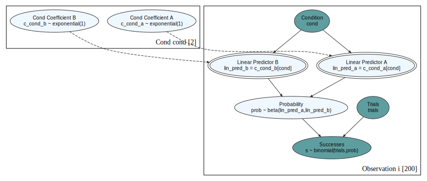
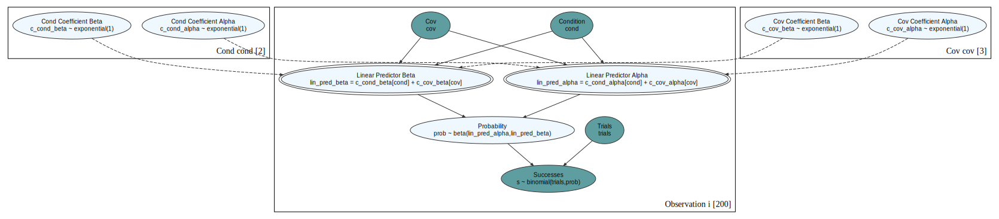
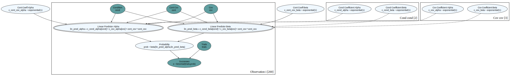

# Introduction

Some time ago I wrote a [post](https://prabinov42.github.io/posts/greta_and_causact/) abut using the *causact* R library, which uses the greta library, which uses TensorFlow to estimate Bayesian models.  

Since then causact has been rewritten to us the *numpyro* library, which seems much faster than greta & tensorflow. And [the book](https://www.causact.com/) correspondingly has a new edition.

Its author, Adam has been incredibly responsive in fixing any bugs, and I have stolen some of his code (from his book) below.

Here is the plan - I want to analyze a typical A/B test, where there is a discrete covariate, as well as a continuous one using causact.

We'll build up the models step-by-step, adding complexity as we go.

I will touch only minimally on proper Bayesian workflow - that is covered in [here](https://betanalpha.github.io/assets/case_studies/principled_bayesian_workflow.html) and [here](http://www.stat.columbia.edu/~gelman/research/unpublished/Bayesian_Workflow_article.pdf) far better than I ever could.

After doing a fairly conventional logistic regression model, we will also look at kind of a beta regression model. In fact I'm not sure if the model _is_ a Bayesian beta regression model or not - and it doesn't matter. That is the great thing about Bayesian methods - they allow you to express your assumptions in an explicit manner regardless of if you know the names of a whole zoo of models.

Causact helps in this regard because the diagrams you create are very easy to explain to stakeholders - there are no hidden assumptions. And the best part is that the diagrams and the code do never get out of synch - the code is the diagram is the model.

```{r, message=FALSE, warning=FALSE}
library(tidyverse)
library(bayesplot)
library(ggridges)
library(patchwork)
library(causact)
```

# The data

Lets create some data to work with.

```{r}
set.seed(2023)
n_subjects <- 200

df <- tibble(id=1:(n_subjects)) %>% 
  mutate(cond = sample(c('ctrl','trtmt'),nrow(.), replace=TRUE))%>% 
  mutate(disc_cov = sample(c('a','b','c'),nrow(.), replace=TRUE))%>% 
  mutate(cont_cov = rnorm(nrow(.), 0,1))  %>% 
  mutate(trials = sample(5:25, nrow(.), replace=TRUE)) %>% 
  mutate(lin_pred = 0.2*cont_cov+0.3*case_when(disc_cov=='a'~1,  disc_cov=='b'~0,   disc_cov=='c'~ -1)+if_else(cond=='trtmt',1,0)) %>% 
  mutate(prob = 1 / (1+exp(-lin_pred))) %>% 
  mutate(successes = rbinom(nrow(.),trials, prob)) %>% 
  select(cond, disc_cov, cont_cov, trials, successes, trials) %>%
  mutate(estprob=successes/trials)
```


```{r}
df %>% glimpse()
```

Here we have our data:
- cond: this indicates if the subject was part of the control or treatment group
- disc_cov: a discrete covariate with three possible values A, B & C for each subject
- cont_cov: a continuous covariate for each subject
- trials: the number of trials the subject underwent
- successes: how many successes the subject achieved
- estprob: the estimated probability of success for this subject, = successes/trials. 

Next we look to see what the histograms of the two groups look like:

```{r}
df %>% ggplot(aes( x = estprob, y = cond))+ geom_density_ridges(stat = "binline", bins = 20, scale = 0.95, draw_baseline = FALSE)+theme_minimal()
```

# Logistic regression like models

Here we construct a model that looks like a logistic regression. The key to understanding it is to go slow when analyzing the code that generates the diagram, and to understand the model focus on the the linear predictor:  

c_cond + c_disc_cov+c_cont_cov*cont_cov  

We have a coefficient for the condition (cond) ctrl or trtmt, and we have  a coefficient for a discrete covariate (c_disc_cov) 'a', 'b' or 'c', as well as one for the continuous covariate (c_cont_cov)

```{r}
graph <- dag_create() %>%
  dag_node("Successes","s", rhs = binomial(trials,prob), data = df$successes) %>%
  dag_node("Probability","prob", child = "s", rhs = 1 / (1+exp(-lin_pred))) %>%
  dag_node("Trials","trials", child = "s", data = df$trials) %>%
  dag_node("Linear Predictor","lin_pred", rhs = c_cond + c_disc_cov+c_cont_cov*cont_cov, child = "prob") %>%
  dag_node("Cond Coefficient","c_cond", rhs = normal(0,3), child = "lin_pred") %>%
  dag_node("Disc Coeff","c_disc_cov", rhs = normal(0,3), child = "lin_pred") %>%
  dag_node("Cont Coeff","c_cont_cov", rhs = normal(0,3), child = "lin_pred") %>%  
  dag_node("Cont Cov","cont_cov", child = "lin_pred", data = df$cont_cov) %>%  
  dag_plate("Disc","d", nodeLabels = c("c_disc_cov"), data = df$disc_cov, addDataNode = TRUE) %>%
  dag_plate("Cond","cond", nodeLabels = c("c_cond"), data = df$cond, addDataNode = TRUE) %>%  
  dag_plate("Observation","i", nodeLabels = c("s","disc_cov","cond","cont_cov","trials","prob","lin_pred"))
```

This is what the model looks like.

```{r}
graph %>% dag_render()
```

Note how easy it is to explain this model to someone who isn't a statistician.

Now we can infer the values of the parameters.

```{r}
drawsDF <- graph %>% dag_numpyro()
```

and can plot the coefficients

```{r}
drawsDF %>% dagp_plot()
```

and check the chains to make sure they are fuzzy caterpillars

```{r}
drawsDF %>% mcmc_trace()
```

and calculate some stuff. 

Note the proper way to do this is described [here](https://solomonkurz.netlify.app/blog/2023-04-24-causal-inference-with-logistic-regression/), as "Unlike with OLS-type models, you cannot estimate the ATE in a logistic-regression context with beta_1 alone. You need to account for the other parameters in the model, too."
  
We illustrate that later, but here we do a simpler (incorrect) approach to show how to code it.

```{r}
drawsDF %>% 
  select(c_cond_ctrl,c_cond_trtmt ) %>% 
  summarise(across(everything(), mean)) %>%
  mutate(across(everything(), plogis)) %>%
  mutate(dif=c_cond_trtmt-c_cond_ctrl)
```

We can compare that to a standard logistic regression
  
```{r}
mylm<-glm(cbind(successes, trials-successes)~0+cond+disc_cov+cont_cov,family=stats::binomial, data = df)
```

```{r}
mylm %>% summary()
```

```{r}
mylm%>%marginaleffects::avg_comparisons(variables="cond")
```

This is the effect in our sample, which if we assume is representative of the population (same probabilities of each covariate, etc) is our population effect. We expect the trtmt group to by between 0.188 and 0.257 higher with an average of boy 0.222 which is pretty close to the 0.235 we obtained above.

With some more work:

```{r}
ansdf<- tibble()  
for (i in 1:nrow(df)) {
  z_cond <- df$cond[i]
  z_disc_cov <- df$disc_cov[i]
  z_cont_cov <- df$cont_cov[i]
  z_trials <- df$trials[i]
  z_successes <- df$successes[i]
  z_estprob <- df$estprob[i]
  ans <- drawsDF %>%
    mutate(
      zc=z_cond,
      f_cond = if_else(zc=='ctrl', c_cond_ctrl, c_cond_trtmt),
      f_disc_cov = case_when(
        z_disc_cov=='a'~c_disc_cov_a,
        z_disc_cov=='b'~c_disc_cov_b,
        z_disc_cov=='c'~c_disc_cov_c,
      ),
      f_cont = c_cont_cov*z_cont_cov,
      lin_pred = f_cond+f_disc_cov+f_cont,
      prob = plogis(lin_pred),
      sucs = rbinom(nrow(.),z_trials, prob),
      trials=z_trials
    )
  ansdf<-ansdf %>% bind_rows(ans)
}
```

```{r}
ansdf %>% 
  mutate(ep = sucs/trials) %>%
  group_by(zc) %>%
  summarize(mn = mean(ep)) %>%
  pivot_wider(names_from = zc, values_from = mn)%>%
  mutate(effect = trtmt-ctrl)
```

we obtain the same effect (0.22) as with logistic regression.

# Priors

Of course, with Bayesian methods you need to specify your priors, and here we show how to compute some things...

## Prior Predictive

We play around with the priors (pretending we had prior knowledge)

```{r}
# This is basically Adam's code from the book
nSamples <- 50
df_params <- tibble(
  c_cond = rnorm(nSamples, 0, .25),
  c_disc_cov = rnorm(nSamples, 0, .25),
  c_cont_cov = rnorm(nSamples, 0, .25)
)

simObs <- function(c_cond, c_disc_cov, c_cont_cov) {
  n <- 200
  simVector <- df %>%
    mutate(
      lin_pred = c_cond + c_disc_cov + c_cont_cov * cont_cov,
      prob = 1 / (1 + exp(-lin_pred)),
      s = rbinom(nrow(.), trials, prob),
      val = s / trials
    )
  return(simVector$val)
}

simsList <- pmap(df_params, simObs)
names(simsList) <- paste0("sim", 1:length(simsList))
simsDF <- as_tibble(simsList)
plotDF <- simsDF %>% pivot_longer(cols = everything())
obsDF <- tibble(obs = df$estprob)

colors <- c("simulated" = "cadetblue", "observed" = "darkgreen")

ggplot(plotDF) +
  stat_density(aes(x = value, group = name, color = "simulated"), geom = "line", position = "identity", alpha=0.25) +
  stat_density(data = obsDF, aes(x = obs, color = "observed"), geom = "line", position = "identity", lwd = 2) +
  scale_color_manual(values = colors) +
  labs(x = "Outcome (successes/trials)", y = "Density Estimated from Data", color = "Data Type") +
  theme_minimal()
```

Looks _passable_, but peaks are in wrong place. 


# Final Model

We decide that the prior predictive looks reasonable enough, so let's calculate the posteriors.

```{r}
graph <- dag_create() %>%
  dag_node("Successes","s", rhs = binomial(trials,prob), data = df$successes) %>%
  dag_node("Probability","prob", child = "s", rhs = 1 / (1+exp(-lin_pred))) %>%
  dag_node("Trials","trials", child = "s", data = df$trials) %>%
  dag_node("Linear Predictor","lin_pred", rhs = c_cond + c_disc_cov+c_cont_cov*cont_cov, child = "prob") %>%
  dag_node("Cond Coefficient","c_cond", rhs = normal(0,1/4), child = "lin_pred") %>%
  dag_node("Disc Coeff","c_disc_cov", rhs = normal(0,1/4), child = "lin_pred") %>%
  dag_node("Cont Coeff","c_cont_cov", rhs = normal(0,1/4), child = "lin_pred") %>%  
  dag_node("Cont Cov","cont_cov", child = "lin_pred", data = df$cont_cov) %>%  
  dag_plate("Disc","d", nodeLabels = c("c_disc_cov"), data = df$disc_cov, addDataNode = TRUE) %>%
  dag_plate("Cond","cond", nodeLabels = c("c_cond"), data = df$cond, addDataNode = TRUE) %>%  
  dag_plate("Observation","i", nodeLabels = c("s","disc_cov","cond","cont_cov","trials","prob","lin_pred"))
graph %>% dag_render()
```

```{r}
drawsDF <- graph %>% dag_numpyro()
```

```{r}
drawsDF %>% dagp_plot()
```

```{r}
drawsDF %>% mcmc_trace()
```

All looks reasonable.

# Posterior Predictive

Lets calculate the posterior predictive and compare to the actual.

```{r}
nSamples <- 50

drawsDFp<-drawsDF %>% slice_sample(n=nSamples)

simObs <- function(c_cont_cov, c_cond_ctrl, c_cond_trtmt, c_disc_cov_b, c_disc_cov_a, c_disc_cov_c) {
  n <- 200
  simVector <- df %>%
    mutate(
      lin_pred = if_else(cond=='ctrl',c_cond_ctrl, c_cond_trtmt)+
        case_when(disc_cov=='a'~c_disc_cov_a,disc_cov=='b'~c_disc_cov_b,disc_cov=='c'~c_disc_cov_c)  +
        c_cont_cov * cont_cov,
      prob = 1 / (1 + exp(-lin_pred)),
      s = rbinom(nrow(.), trials, prob),
      val = s / trials
    )
  return(simVector$val)
}

simsList <- pmap(drawsDFp, simObs)
names(simsList) <- paste0("sim", 1:length(simsList))
simsDF <- as_tibble(simsList)
plotDF <- simsDF %>% pivot_longer(cols = everything())
obsDF <- tibble(obs = df$estprob)

colors <- c("simulated" = "cadetblue", "observed" = "darkgreen")

ggplot(plotDF) +
  stat_density(aes(x = value, group = name, color = "simulated"), geom = "line", position = "identity", alpha=0.25) +
  stat_density(data = obsDF, aes(x = obs, color = "observed"), geom = "line", position = "identity", lwd = 2) +
  scale_color_manual(values = colors) +
  labs(x = "Outcome (successes/trials)", y = "Density Estimated from Data", color = "Data Type") +
  theme_minimal()
```

There is pretty good agreement (except for the slight hump in the observed data at about 0.3 or so).

Now lets look at successes, not estimate probability of success

```{r}
simObs <- function(c_cont_cov, c_cond_ctrl, c_cond_trtmt, c_disc_cov_b, c_disc_cov_a, c_disc_cov_c) {
  n <- 200
  simVector <- df %>%
    mutate(
      lin_pred = if_else(cond=='ctrl',c_cond_ctrl, c_cond_trtmt)+
        case_when(disc_cov=='a'~c_disc_cov_a,disc_cov=='b'~c_disc_cov_b,disc_cov=='c'~c_disc_cov_c)  +
        c_cont_cov * cont_cov,
      prob = 1 / (1 + exp(-lin_pred)),
      s = rbinom(nrow(.), trials, prob),
      val = s 
    )
  return(simVector$val)
}

simsList <- pmap(drawsDFp, simObs)
names(simsList) <- paste0("sim", 1:length(simsList))
simsDF <- as_tibble(simsList)
plotDF <- simsDF %>% pivot_longer(cols = everything())
obsDF <- tibble(obs = df$successes)

colors <- c("simulated" = "cadetblue", "observed" = "darkgreen")

ggplot(plotDF) +
  stat_density(aes(x = value, group = name, color = "simulated"), geom = "line", position = "identity", alpha=0.25) +
  stat_density(data = obsDF, aes(x = obs, color = "observed"), geom = "line", position = "identity", lwd = 2) +
  scale_color_manual(values = colors) +
  labs(x = "Outcome (successes/trials)", y = "Density Estimated from Data", color = "Data Type") +
  theme_minimal()
```

Pretty good agreement here too.


So what does all this mean? Let's try to understand on particular set of covariates: if we set the discrete covariate to 'a', the continuous covariate to 1, and have 10 trials, what are posterior predictions for the number of successes under each condition, and what is their difference?

```{r}
x_disc_cov<-'a'
x_cont_cov<-1
x_trials <-10

drawsDF %>%
  mutate(
    lin_pred_c = c_cond_ctrl+c_disc_cov_a+c_cont_cov*1,
    lin_pred_t = c_cond_trtmt+c_disc_cov_a+c_cont_cov*1,
    prob_c = 1 / (1 + exp(-lin_pred_c)),
    prob_t = 1 / (1 + exp(-lin_pred_t)),
    s_c = rbinom(nrow(.), 10, prob_c),
    s_t = rbinom(nrow(.), 10, prob_t),
    dif=s_t-s_c
  ) %>%
  select(s_c,s_t,dif)%>%
  pivot_longer(cols=everything()) %>%
  mutate(name=case_when(
    name=='s_c'~ 'Successes (Control)', 
    name=='s_t'~ 'Successes (Treatment)', 
    name=='dif'~ 'Difference (Treatment - Control)', 
    ))%>%
  ggplot(aes( x = value))+
  geom_histogram()+
  theme_minimal()+
  labs( x = 'Value', y = 'Count')+
  facet_wrap(~name, nrow = 3)
```

# A more compplicated model

What if the success probability depends on the interaction between the condition and the discrete covariate, rather than just additively? A small adjustment to the graph takes care of that easily.

```{r}
graph <- dag_create() %>%
  dag_node("Successes", "s", rhs = binomial(trials, prob), data = df$successes) %>%
  dag_node("Trials","trials", child = "s", data = df$trials) %>%
  dag_node("prob", "prob", rhs = 1 / (1+exp(-lin_pred)), child = "s") %>%
  dag_node("lin_pred", "lin_pred", rhs = mu+cont_cov*cont_coef, child = "prob") %>%  
  dag_node("cont_coef", "cont_coef", rhs = normal(0,1), child = "lin_pred") %>%
  dag_node("Cont Cov","cont_cov", child = "lin_pred", data = df$cont_cov) %>%    
  dag_node("mu", "mu", rhs = normal(0,1), child = "lin_pred") %>%
  dag_plate("Condition Effect", "i", nodeLabels = c("mu"), data = df$cond, addDataNode = TRUE) %>%
  dag_plate("Covariate Effect", "j", nodeLabels = c("mu"), data = df$disc_cov, addDataNode = TRUE) %>%
  dag_plate("Observation","o", nodeLabels = c("s","i","j","trials","prob","lin_pred","cont_cov"))
graph %>% dag_render()
drawsDF <- graph %>% dag_numpyro()
drawsDF %>% dagp_plot()
drawsDF %>% mcmc_trace()
```

# Beta model

I confess - i never  liked logistic regression. I have no 'feel' for the transformations required. For some reason I do think I understand the beta distribution better, so we'll try to understand the same data here using a beta model. We'll model the probability of success as a beta with parameters depending on covariates.

First we need some utility functions to go between various parametrizations of the beta.

```{r}
ab_2_muphi <- function(a, b) {
  list(
    mu = a / (a + b),
    phi = a + b
  )
}

muphi_2_ab <- function(mu, phi) {
  list(
    a = mu * phi,
    b = (1 - mu) * phi
  )
}

ab_2_musigma <- function(a, b) {
  list(
    mu = a / (a + b),
    sigma = sqrt(a * b / (a + b)^2 / (a + b + 1))
  )
}

musigma_2_ab <- function(mu, sigma) {
  list(
    a = (mu^2 - mu^3 - mu * sigma^2) / sigma^2,
    b = (mu - 1) * (sigma^2 - mu + mu^2) / sigma^2
  )
}

muphi_musigma <- function(mu, phi) {
  p1 <- muphi_2_ab(mu, phi)
  p2 <- ab_2_musigma(p1$a, p1$b)
  list(mu = p2$mu, sigma = p2$sigma)
}

musigma_muphi <- function(mu, sigma) {
  p1 <- musigma_2_ab(mu, sigma)
  p2 <- ab_2_muphi(p1$a, p1$b)
  list(
    mu = p2$mu,
    phi = p2$phi
  )
}

```

To get started lets build a really simple model....the coefficients of the beta distribution depend just on the condition. That's it.

```{r}
graph <- dag_create() %>%
  dag_node("Successes","s", rhs = binomial(trials,prob), data = df$successes) %>%
  dag_node("Probability","prob", child = "s", rhs =  beta(a,b)) %>%
  dag_node("a","a", child = "prob", rhs =  exponential(1)) %>%
  dag_node("b","b", child = "prob", rhs =  exponential(1)) %>%  
  dag_node("Trials","trials", child = "s", data = df$trials) %>%
  dag_plate("Cond","cond", nodeLabels = c("a","b"), data = df$cond, addDataNode = TRUE) %>%  
  dag_plate("Observation","i", nodeLabels = c("s","trials","prob","cond"))
graph %>% dag_render()
```

Why did we use exponential(1) priors? Well we need positive numbers for the coefficients, so the exponential distribution is a reasonable choice. Why with parameter 1? An exponential(1) has mean 1, and a beta(1,1) is uniform...so it seems reasonable.

```{r}
drawsDF <- graph %>% dag_numpyro()

drawsDF %>% dagp_plot()
drawsDF %>% mcmc_trace()
```

Next we pull out the four coefficients and map them via the transformations above to something easier to understand.

```{r}
drawsDF %>%
  mutate(
    ctrl = map2(a_ctrl,b_ctrl,ab_2_musigma),
    trtmt = map2(a_trtmt,b_trtmt,ab_2_musigma)
  ) %>%
  unnest_wider(ctrl:trtmt, names_sep="_") %>%
  select(ctrl_mu:trtmt_sigma)%>%
  pivot_longer(cols=everything()) %>%  
  ggplot(aes( x = value))+
  geom_histogram()+
  facet_wrap(~name, nrow=2)+
  theme_minimal()
```

Nice!

To pave the way to add in covariates we add in a linear predictor for the two coefficients of the beta distribution. It took few trials to get the graph right. I couldn't get it, but Adam to the rescue! He suggested using the dag_node("Condition") and dag_edge("cond") constructs near the end of the code.

```{r}
graph <- dag_create() %>% 
  dag_node("Successes", "s", rhs = binomial(trials, prob), data = df$successes) %>% 
  dag_node("Probability", "prob", child = "s", rhs = beta(lin_pred_a, lin_pred_b)) %>% 
  dag_node("Linear Predictor A", "lin_pred_a", rhs = c_cond_a, child = "prob") %>% 
  dag_node("Linear Predictor B", "lin_pred_b", rhs = c_cond_b, child = "prob") %>% 
  dag_node("Cond Coefficient A", "c_cond_a", rhs = exponential(1), child = c("lin_pred_a")) %>% 
  dag_node("Cond Coefficient B", "c_cond_b", rhs = exponential(1), child = c("lin_pred_b")) %>%
  dag_node("Trials", "trials", child = "s", data = df$trials) %>%
  dag_plate("Cond", "cond", nodeLabels = c("c_cond_a", "c_cond_b"), data = df$cond, addDataNode = FALSE) %>% 
  dag_node("Condition","cond", data = df$cond) %>% 
  dag_edge("cond",c("lin_pred_a","lin_pred_b")) %>% 
  dag_plate("Observation", "i", nodeLabels = c("s", "trials", "prob", "lin_pred_a", "lin_pred_b","cond")) 

# to make things work w github to get a larger pic
plt <- graph %>% dag_render() 

plt %>%
  DiagrammeRsvg::export_svg() %>%
  xml2::read_xml() %>%
  xml2::write_xml("plt_1.svg")
```


<div style="width: 300%">

</div>


```{r}
drawsDF <- graph %>% dag_numpyro()
drawsDF %>% dagp_plot()
```


Next we'll want to add back in the discrete covariate (but we will have the discrete covariate be independent of the experimental conditions here)

```{r}
graph <- dag_create() %>% 
  dag_node("Successes", "s", rhs = binomial(trials, prob), data = df$successes) %>% 
  dag_node("Probability", "prob", child = "s", rhs = beta(lin_pred_alpha, lin_pred_beta)) %>% 
  dag_node("Linear Predictor Alpha", "lin_pred_alpha", rhs = c_cond_alpha+c_cov_alpha, child = "prob") %>% 
  dag_node("Linear Predictor Beta", "lin_pred_beta", rhs = c_cond_beta+c_cov_beta, child = "prob") %>% 
  dag_node("Cond Coefficient Alpha", "c_cond_alpha", rhs = exponential(1), child = c("lin_pred_alpha")) %>% 
  dag_node("Cond Coefficient Beta", "c_cond_beta", rhs = exponential(1), child = c("lin_pred_beta")) %>%
  dag_node("Cov Coefficient Alpha", "c_cov_alpha", rhs = exponential(1), child = c("lin_pred_alpha")) %>% 
  dag_node("Cov Coefficient Beta", "c_cov_beta", rhs = exponential(1), child = c("lin_pred_beta")) %>%
  dag_node("Trials", "trials", child = "s", data = df$trials) %>%
  dag_plate("Cond", "cond", nodeLabels = c("c_cond_alpha", "c_cond_beta"), data = df$cond, addDataNode = FALSE) %>% 
  dag_plate("Cov", "cov", nodeLabels = c("c_cov_alpha", "c_cov_beta"), data = df$disc_cov, addDataNode = FALSE) %>% 
  dag_node("Condition","cond", data = df$cond) %>%
  dag_node("Cov","cov", data = df$disc_cov) %>%   
  dag_edge("cond",c("lin_pred_alpha","lin_pred_beta")) %>%
  dag_edge("cov",c("lin_pred_alpha","lin_pred_beta")) %>%   
  dag_plate("Observation", "i", nodeLabels = c("s", "trials", "prob", "lin_pred_alpha", "lin_pred_beta","cond","cov")) 

plt <- graph %>% dag_render() 

plt %>%
  DiagrammeRsvg::export_svg() %>%
  xml2::read_xml() %>%
  xml2::write_xml("plt_2.svg")
```

<div style="width: 300%">

</div>

```{r}
drawsDF <- graph %>% dag_numpyro()
```

The plot with all the parameters is getting a bit large, so we'll split into two.

```{r}
drawsDF %>% select(contains("cond")) %>% dagp_plot()
```

```{r}
drawsDF %>% select(contains("cov")) %>% dagp_plot()
```


Finally, we'll want to add in the continuous covariate

This is a little more complicated because we need the linear predictor to be a positive number, and if the input (the continuous covariate) is negative and its coefficient is positive (or vice-versa) the predictor could be negative. So we need to ensure it is positive....how to to that?
Rather than feeding in the raw covariate, we could feed in the exponential of it...that will keep it positive. But, taking the exponential of a moderately large number may yield overflow (eg exp(100)), so we'll center & scale these continuous variables. Note in our example the continuous covariate was already centered & scaled.

```{r}
graph <- dag_create() %>% 
  dag_node("Successes", "s", rhs = binomial(trials, prob), data = df$successes) %>% 
  dag_node("Probability", "prob", child = "s", rhs = beta(lin_pred_alpha, lin_pred_beta)) %>% 
  dag_node("Linear Predictor Alpha", "lin_pred_alpha", rhs = c_cond_alpha+c_cov_alpha+cont_cov*cont_cov, child = "prob") %>% 
  dag_node("Linear Predictor Beta", "lin_pred_beta", rhs = c_cond_beta+c_cov_beta+cont_cov*cont_cov, child = "prob") %>% 
  dag_node("Cond Coefficient Alpha", "c_cond_alpha", rhs = exponential(1), child = c("lin_pred_alpha")) %>% 
  dag_node("Cond Coefficient Beta", "c_cond_beta", rhs = exponential(1), child = c("lin_pred_beta")) %>%
  dag_node("Cov Coefficient Alpha", "c_cov_alpha", rhs = exponential(1), child = c("lin_pred_alpha")) %>% 
  dag_node("Cov Coefficient Beta", "c_cov_beta", rhs = exponential(1), child = c("lin_pred_beta")) %>%
  dag_node("Cont Coeff Alpha","c_cont_cov_alpha", rhs = exponential(1), child = "lin_pred_alpha") %>%  
  dag_node("Cont Coeff Beta","c_cont_cov_beta", rhs = exponential(1), child = "lin_pred_beta") %>%      
  dag_node("Trials", "trials", child = "s", data = df$trials) %>%
  dag_plate("Cond", "cond", nodeLabels = c("c_cond_alpha", "c_cond_beta"), data = df$cond, addDataNode = FALSE) %>% 
  dag_plate("Cov", "cov", nodeLabels = c("c_cov_alpha", "c_cov_beta"), data = df$disc_cov, addDataNode = FALSE) %>% 
  dag_node("Condition","cond", data = df$cond) %>%
  dag_node("Cov","cov", data = df$disc_cov) %>%
  dag_node("Cont Cov","cont", data = exp(df$cont_cov)) %>%     
  dag_edge("cond",c("lin_pred_alpha","lin_pred_beta")) %>%
  dag_edge("cov",c("lin_pred_alpha","lin_pred_beta")) %>%   
  dag_edge("cont",c("lin_pred_alpha","lin_pred_beta")) %>%     
  dag_plate("Observation", "i", nodeLabels = c("s", "trials", "prob", "lin_pred_alpha", "lin_pred_beta","cond","cov","cont")) 

plt <- graph %>% dag_render() # perfect!

plt %>%
  DiagrammeRsvg::export_svg() %>%
  xml2::read_xml() %>%
  xml2::write_xml("plt_3.svg")
```

<div style="width: 300%">

</div>

```{r}
drawsDF <- graph %>% dag_numpyro()
```

And we'll split out the plots again.

```{r}
drawsDF %>% select(contains("cond")) %>% dagp_plot()
```

```{r}
drawsDF %>% select(contains("c_cov")) %>% dagp_plot()
```

```{r}
drawsDF %>% select(contains("c_cont")) %>% dagp_plot()
```

Again, we can manipulate the drawsDF tibble to get anything we might need

```{r}
drawsDF %>%
  mutate(
    ctrl = map2(c_cond_alpha_ctrl,c_cond_beta_ctrl,ab_2_musigma),
    trtmt = map2(c_cond_alpha_trtmt,c_cond_beta_trtmt,ab_2_musigma)
  ) %>%
  unnest_wider(ctrl:trtmt, names_sep="_") %>%
  select(ctrl_mu:trtmt_sigma)%>%
  pivot_longer(cols=everything()) %>%  
  ggplot(aes( x = value))+
  geom_histogram()+
  facet_wrap(~name, nrow=2)+
  theme_minimal()
```


```{r}
drawsDF %>%
  mutate(
    cov_a = map2(c_cov_alpha_a,c_cov_beta_a,ab_2_musigma),
    cov_b = map2(c_cov_alpha_b,c_cov_beta_b,ab_2_musigma),
    cov_c = map2(c_cov_alpha_c,c_cov_beta_c,ab_2_musigma),    
  ) %>%
  unnest_wider(cov_a:cov_c, names_sep="_") %>%
  select(cov_a_mu:cov_c_sigma)%>%
  pivot_longer(cols=everything()) %>%  
  ggplot(aes( x = value))+
  geom_histogram()+
  facet_wrap(~name, nrow=3)+
  theme_minimal()
```

```{r}
drawsDF %>%
  mutate(
    cont = map2(c_cont_cov_alpha,c_cont_cov_beta,ab_2_musigma)
  ) %>%
  unnest_wider(cont,names_sep="_") %>%
  select(cont_mu:cont_sigma)%>%
  pivot_longer(cols=everything()) %>%  
  ggplot(aes( x = value))+
  geom_histogram()+
  facet_wrap(~name, nrow=1)+
  theme_minimal()
```


# Posterior Predictive

Finally we'll look at the posterior predictive of each condition to see the differences.

```{r}
nSamples <- 100

drawsDFp<-drawsDF %>% slice_sample(n=nSamples) %>%
  select(contains("cond"))

pl<-ggplot()+xlim(0, 1)

for(i in 1:nSamples){
pl<-pl+geom_function(fun = dbeta, args = list(shape1 = drawsDFp$c_cond_alpha_ctrl[i], shape2 = drawsDFp$c_cond_beta_ctrl[i]), alpha=0.1)
}

p_ctrl<-pl+theme_minimal()

pl<-ggplot()+xlim(0, 1)

for(i in 1:nSamples){
pl<-pl+geom_function(fun = dbeta, args = list(shape1 = drawsDFp$c_cond_alpha_trtmt[i], shape2 = drawsDFp$c_cond_beta_trtmt[i]), alpha=0.1)
}

p_trtmt<-pl+theme_minimal()

p_ctrl/p_trtmt
```


# Appendices

<details>

<summary>

References

</summary>

[greta](https://greta-stats.org/index.html)  
[causact](https://www.causact.com/)  

</details>

<details>

<summary>

SessionInfo

</summary>

```{r}
sessionInfo()
```

</details>
