Causact: A/B Test
================
Peter Rabinovitch
2023-09-30 14:40:42

# Introduction

Some time ago I wrote a
[post](https://prabinov42.github.io/posts/greta_and_causact/) abut using
the *causact* R library, which uses the greta library, which uses
TensorFlow to estimate Bayesian models.

Since then causact has been rewritten to us the *numpyro* library, which
seems much faster than greta & tensorflow. And [the
book](https://www.causact.com/) correspondingly has a new edition.

Its author, Adam has been incredibly responsive in fixing any bugs, and
I have stolen some of his code (from his book) below.

Here is the plan - I want to analyze a typical A/B test, where there is
a discrete covariate, as well as a continuous one using causact.

We’ll build up the models step-by-step, adding complexity as we go.

I will touch only minimally on proper Bayesian workflow - that is
covered in
[here](https://betanalpha.github.io/assets/case_studies/principled_bayesian_workflow.html)
and
[here](http://www.stat.columbia.edu/~gelman/research/unpublished/Bayesian_Workflow_article.pdf)
far better than I ever could.

After doing a fairly conventional logistic regression model, we will
also look at kind of a beta regression model. In fact I’m not sure if
the model *is* a Bayesian beta regression model or not - and it doesn’t
matter. That is the great thing about Bayesian methods - they allow you
to express your assumptions in an explicit manner regardless of if you
know the names of a whole zoo of models.

Causact helps in this regard because the diagrams you create are very
easy to explain to stakeholders - there are no hidden assumptions. And
the best part is that the diagrams and the code do never get out of
synch - the code is the diagram is the model.

``` r
library(tidyverse)
library(bayesplot)
library(ggridges)
library(patchwork)
library(causact)
```

# The data

Lets create some data to work with.

``` r
set.seed(2023)
n_subjects <- 200

df <- tibble(id=1:(n_subjects)) %>% 
  mutate(cond = sample(c('ctrl','trtmt'),nrow(.), replace=TRUE))%>% 
  mutate(disc_cov = sample(c('a','b','c'),nrow(.), replace=TRUE))%>% 
  mutate(cont_cov = rnorm(nrow(.), 0,1))  %>% 
  mutate(trials = sample(5:25, nrow(.), replace=TRUE)) %>% 
  mutate(lin_pred = 0.2*cont_cov+0.3*case_when(disc_cov=='a'~1,  disc_cov=='b'~0,   disc_cov=='c'~ -1)+if_else(cond=='trtmt',1,0)) %>% 
  mutate(prob = 1 / (1+exp(-lin_pred))) %>% 
  mutate(successes = rbinom(nrow(.),trials, prob)) %>% 
  select(cond, disc_cov, cont_cov, trials, successes, trials) %>%
  mutate(estprob=successes/trials)
```

``` r
df %>% glimpse()
```

    ## Rows: 200
    ## Columns: 6
    ## $ cond      <chr> "ctrl", "trtmt", "ctrl", "ctrl", "trtmt", "ctrl", "trtmt", "…
    ## $ disc_cov  <chr> "b", "a", "b", "a", "c", "c", "a", "a", "c", "b", "a", "a", …
    ## $ cont_cov  <dbl> -0.78957675, -1.82008983, -1.41730144, -1.44662848, -1.26236…
    ## $ trials    <int> 16, 21, 5, 6, 14, 24, 19, 6, 9, 13, 16, 10, 15, 12, 8, 6, 24…
    ## $ successes <int> 7, 16, 1, 3, 6, 10, 14, 4, 7, 5, 11, 2, 2, 5, 3, 5, 17, 11, …
    ## $ estprob   <dbl> 0.4375000, 0.7619048, 0.2000000, 0.5000000, 0.4285714, 0.416…

Here we have our data: - cond: this indicates if the subject was part of
the control or treatment group - disc_cov: a discrete covariate with
three possible values A, B & C for each subject - cont_cov: a continuous
covariate for each subject - trials: the number of trials the subject
underwent - successes: how many successes the subject achieved -
estprob: the estimated probability of success for this subject, =
successes/trials.

Next we look to see what the histograms of the two groups look like:

``` r
df %>% ggplot(aes( x = estprob, y = cond))+ geom_density_ridges(stat = "binline", bins = 20, scale = 0.95, draw_baseline = FALSE)+theme_minimal()
```

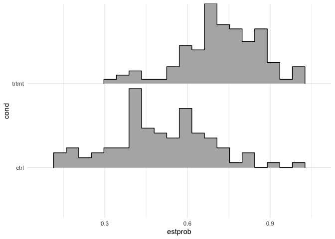<!-- -->

# Logistic regression like models

Here we construct a model that looks like a logistic regression. The key
to understanding it is to go slow when analyzing the code that generates
the diagram, and to understand the model focus on the the linear
predictor:

c_cond + c_disc_cov+c_cont_cov\*cont_cov

We have a coefficient for the condition (cond) ctrl or trtmt, and we
have a coefficient for a discrete covariate (c_disc_cov) ‘a’, ‘b’ or
‘c’, as well as one for the continuous covariate (c_cont_cov)

``` r
graph <- dag_create() %>%
  dag_node("Successes","s", rhs = binomial(trials,prob), data = df$successes) %>%
  dag_node("Probability","prob", child = "s", rhs = 1 / (1+exp(-lin_pred))) %>%
  dag_node("Trials","trials", child = "s", data = df$trials) %>%
  dag_node("Linear Predictor","lin_pred", rhs = c_cond + c_disc_cov+c_cont_cov*cont_cov, child = "prob") %>%
  dag_node("Cond Coefficient","c_cond", rhs = normal(0,3), child = "lin_pred") %>%
  dag_node("Disc Coeff","c_disc_cov", rhs = normal(0,3), child = "lin_pred") %>%
  dag_node("Cont Coeff","c_cont_cov", rhs = normal(0,3), child = "lin_pred") %>%  
  dag_node("Cont Cov","cont_cov", child = "lin_pred", data = df$cont_cov) %>%  
  dag_plate("Disc","d", nodeLabels = c("c_disc_cov"), data = df$disc_cov, addDataNode = TRUE) %>%
  dag_plate("Cond","cond", nodeLabels = c("c_cond"), data = df$cond, addDataNode = TRUE) %>%  
  dag_plate("Observation","i", nodeLabels = c("s","disc_cov","cond","cont_cov","trials","prob","lin_pred"))
```

This is what the model looks like.

``` r
graph %>% dag_render()
```

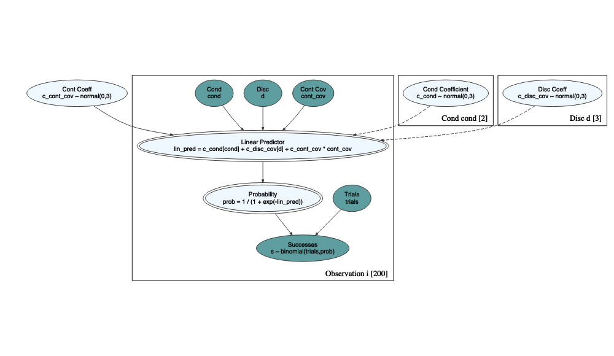<!-- -->

Note how easy it is to explain this model to someone who isn’t a
statistician.

Now we can infer the values of the parameters.

``` r
drawsDF <- graph %>% dag_numpyro()
```

and can plot the coefficients

``` r
drawsDF %>% dagp_plot()
```

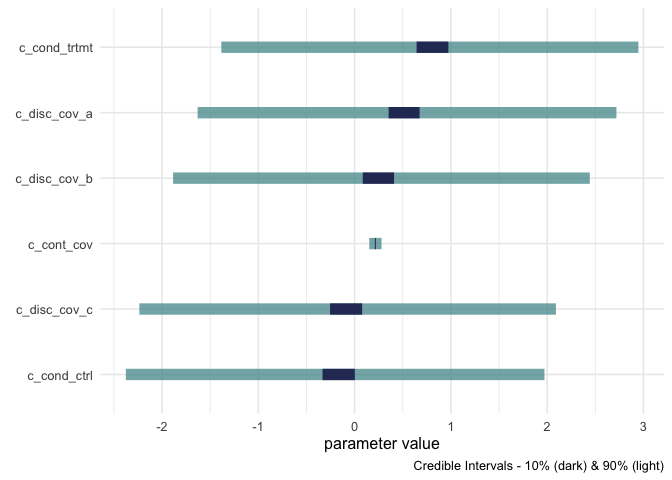<!-- -->

and check the chains to make sure they are fuzzy caterpillars

``` r
drawsDF %>% mcmc_trace()
```

<!-- -->

and calculate some stuff.

Note the proper way to do this is described
[here](https://solomonkurz.netlify.app/blog/2023-04-24-causal-inference-with-logistic-regression/),
as “Unlike with OLS-type models, you cannot estimate the ATE in a
logistic-regression context with beta_1 alone. You need to account for
the other parameters in the model, too.”

We illustrate that later, but here we do a simpler (incorrect) approach
to show how to code it.

``` r
drawsDF %>% 
  select(c_cond_ctrl,c_cond_trtmt ) %>% 
  summarise(across(everything(), mean)) %>%
  mutate(across(everything(), plogis)) %>%
  mutate(dif=c_cond_trtmt-c_cond_ctrl)
```

    ## # A tibble: 1 × 3
    ##   c_cond_ctrl c_cond_trtmt   dif
    ##         <dbl>        <dbl> <dbl>
    ## 1       0.455        0.690 0.235

We can compare that to a standard logistic regression

``` r
mylm<-glm(cbind(successes, trials-successes)~0+cond+disc_cov+cont_cov,family=stats::binomial, data = df)
```

``` r
mylm %>% summary()
```

    ## 
    ## Call:
    ## glm(formula = cbind(successes, trials - successes) ~ 0 + cond + 
    ##     disc_cov + cont_cov, family = stats::binomial, data = df)
    ## 
    ## Deviance Residuals: 
    ##      Min        1Q    Median        3Q       Max  
    ## -2.71521  -0.65328  -0.01192   0.79242   2.48705  
    ## 
    ## Coefficients:
    ##           Estimate Std. Error z value Pr(>|z|)    
    ## condctrl   0.34727    0.08464   4.103 4.08e-05 ***
    ## condtrtmt  1.32522    0.08430  15.721  < 2e-16 ***
    ## disc_covb -0.27303    0.10283  -2.655  0.00793 ** 
    ## disc_covc -0.61089    0.09784  -6.243 4.28e-10 ***
    ## cont_cov   0.21367    0.03903   5.475 4.37e-08 ***
    ## ---
    ## Signif. codes:  0 '***' 0.001 '**' 0.01 '*' 0.05 '.' 0.1 ' ' 1
    ## 
    ## (Dispersion parameter for binomial family taken to be 1)
    ## 
    ##     Null deviance: 618.75  on 200  degrees of freedom
    ## Residual deviance: 218.11  on 195  degrees of freedom
    ## AIC: 786.19
    ## 
    ## Number of Fisher Scoring iterations: 4

``` r
mylm%>%marginaleffects::avg_comparisons(variables="cond")
```

    ## 
    ##  Term     Contrast Estimate Std. Error    z Pr(>|z|)     S 2.5 % 97.5 %
    ##  cond trtmt - ctrl    0.222     0.0176 12.7   <0.001 119.4 0.188  0.257
    ## 
    ## Columns: term, contrast, estimate, std.error, statistic, p.value, s.value, conf.low, conf.high

This is the effect in our sample, which if we assume is representative
of the population (same probabilities of each covariate, etc) is our
population effect. We expect the trtmt group to by between 0.188 and
0.257 higher with an average of boy 0.222 which is pretty close to the
0.235 we obtained above.

With some more work:

``` r
ansdf<- tibble()  
for (i in 1:nrow(df)) {
  z_cond <- df$cond[i]
  z_disc_cov <- df$disc_cov[i]
  z_cont_cov <- df$cont_cov[i]
  z_trials <- df$trials[i]
  z_successes <- df$successes[i]
  z_estprob <- df$estprob[i]
  ans <- drawsDF %>%
    mutate(
      zc=z_cond,
      f_cond = if_else(zc=='ctrl', c_cond_ctrl, c_cond_trtmt),
      f_disc_cov = case_when(
        z_disc_cov=='a'~c_disc_cov_a,
        z_disc_cov=='b'~c_disc_cov_b,
        z_disc_cov=='c'~c_disc_cov_c,
      ),
      f_cont = c_cont_cov*z_cont_cov,
      lin_pred = f_cond+f_disc_cov+f_cont,
      prob = plogis(lin_pred),
      sucs = rbinom(nrow(.),z_trials, prob),
      trials=z_trials
    )
  ansdf<-ansdf %>% bind_rows(ans)
}
```

``` r
ansdf %>% 
  mutate(ep = sucs/trials) %>%
  group_by(zc) %>%
  summarize(mn = mean(ep)) %>%
  pivot_wider(names_from = zc, values_from = mn)%>%
  mutate(effect = trtmt-ctrl)
```

    ## # A tibble: 1 × 3
    ##    ctrl trtmt effect
    ##   <dbl> <dbl>  <dbl>
    ## 1 0.504 0.724  0.220

we obtain the same effect (0.22) as with logistic regression.

# Priors

Of course, with Bayesian methods you need to specify your priors, and
here we show how to compute some things…

## Prior Predictive

We play around with the priors (pretending we had prior knowledge)

``` r
# This is basically Adam's code from the book
nSamples <- 50
df_params <- tibble(
  c_cond = rnorm(nSamples, 0, .25),
  c_disc_cov = rnorm(nSamples, 0, .25),
  c_cont_cov = rnorm(nSamples, 0, .25)
)

simObs <- function(c_cond, c_disc_cov, c_cont_cov) {
  n <- 200
  simVector <- df %>%
    mutate(
      lin_pred = c_cond + c_disc_cov + c_cont_cov * cont_cov,
      prob = 1 / (1 + exp(-lin_pred)),
      s = rbinom(nrow(.), trials, prob),
      val = s / trials
    )
  return(simVector$val)
}

simsList <- pmap(df_params, simObs)
names(simsList) <- paste0("sim", 1:length(simsList))
simsDF <- as_tibble(simsList)
plotDF <- simsDF %>% pivot_longer(cols = everything())
obsDF <- tibble(obs = df$estprob)

colors <- c("simulated" = "cadetblue", "observed" = "darkgreen")

ggplot(plotDF) +
  stat_density(aes(x = value, group = name, color = "simulated"), geom = "line", position = "identity", alpha=0.25) +
  stat_density(data = obsDF, aes(x = obs, color = "observed"), geom = "line", position = "identity", lwd = 2) +
  scale_color_manual(values = colors) +
  labs(x = "Outcome (successes/trials)", y = "Density Estimated from Data", color = "Data Type") +
  theme_minimal()
```

<!-- -->

Looks *passable*, but peaks are in wrong place.

# Final Model

We decide that the prior predictive looks reasonable enough, so let’s
calculate the posteriors.

``` r
graph <- dag_create() %>%
  dag_node("Successes","s", rhs = binomial(trials,prob), data = df$successes) %>%
  dag_node("Probability","prob", child = "s", rhs = 1 / (1+exp(-lin_pred))) %>%
  dag_node("Trials","trials", child = "s", data = df$trials) %>%
  dag_node("Linear Predictor","lin_pred", rhs = c_cond + c_disc_cov+c_cont_cov*cont_cov, child = "prob") %>%
  dag_node("Cond Coefficient","c_cond", rhs = normal(0,1/4), child = "lin_pred") %>%
  dag_node("Disc Coeff","c_disc_cov", rhs = normal(0,1/4), child = "lin_pred") %>%
  dag_node("Cont Coeff","c_cont_cov", rhs = normal(0,1/4), child = "lin_pred") %>%  
  dag_node("Cont Cov","cont_cov", child = "lin_pred", data = df$cont_cov) %>%  
  dag_plate("Disc","d", nodeLabels = c("c_disc_cov"), data = df$disc_cov, addDataNode = TRUE) %>%
  dag_plate("Cond","cond", nodeLabels = c("c_cond"), data = df$cond, addDataNode = TRUE) %>%  
  dag_plate("Observation","i", nodeLabels = c("s","disc_cov","cond","cont_cov","trials","prob","lin_pred"))
graph %>% dag_render()
```

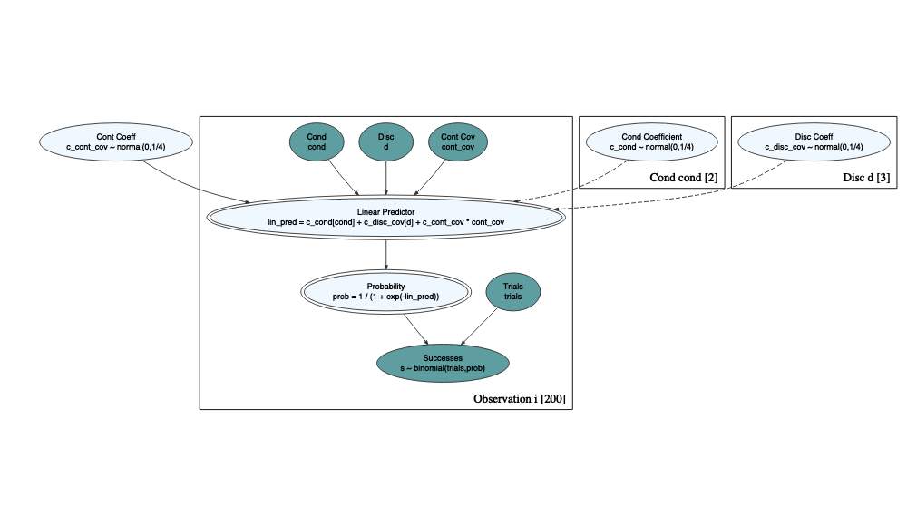<!-- -->

``` r
drawsDF <- graph %>% dag_numpyro()
```

``` r
drawsDF %>% dagp_plot()
```

<!-- -->

``` r
drawsDF %>% mcmc_trace()
```

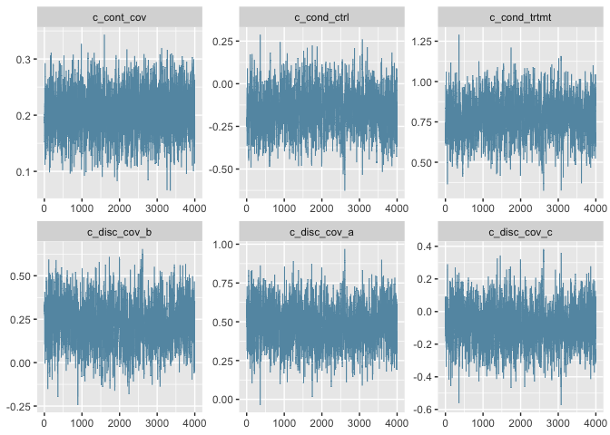<!-- -->

All looks reasonable.

# Posterior Predictive

Lets calculate the posterior predictive and compare to the actual.

``` r
nSamples <- 50

drawsDFp<-drawsDF %>% slice_sample(n=nSamples)

simObs <- function(c_cont_cov, c_cond_ctrl, c_cond_trtmt, c_disc_cov_b, c_disc_cov_a, c_disc_cov_c) {
  n <- 200
  simVector <- df %>%
    mutate(
      lin_pred = if_else(cond=='ctrl',c_cond_ctrl, c_cond_trtmt)+
        case_when(disc_cov=='a'~c_disc_cov_a,disc_cov=='b'~c_disc_cov_b,disc_cov=='c'~c_disc_cov_c)  +
        c_cont_cov * cont_cov,
      prob = 1 / (1 + exp(-lin_pred)),
      s = rbinom(nrow(.), trials, prob),
      val = s / trials
    )
  return(simVector$val)
}

simsList <- pmap(drawsDFp, simObs)
names(simsList) <- paste0("sim", 1:length(simsList))
simsDF <- as_tibble(simsList)
plotDF <- simsDF %>% pivot_longer(cols = everything())
obsDF <- tibble(obs = df$estprob)

colors <- c("simulated" = "cadetblue", "observed" = "darkgreen")

ggplot(plotDF) +
  stat_density(aes(x = value, group = name, color = "simulated"), geom = "line", position = "identity", alpha=0.25) +
  stat_density(data = obsDF, aes(x = obs, color = "observed"), geom = "line", position = "identity", lwd = 2) +
  scale_color_manual(values = colors) +
  labs(x = "Outcome (successes/trials)", y = "Density Estimated from Data", color = "Data Type") +
  theme_minimal()
```

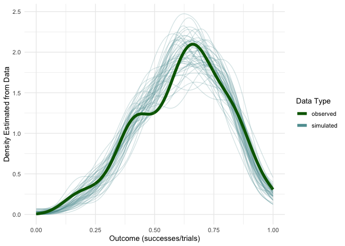<!-- -->

There is pretty good agreement (except for the slight hump in the
observed data at about 0.3 or so).

Now lets look at successes, not estimate probability of success

``` r
simObs <- function(c_cont_cov, c_cond_ctrl, c_cond_trtmt, c_disc_cov_b, c_disc_cov_a, c_disc_cov_c) {
  n <- 200
  simVector <- df %>%
    mutate(
      lin_pred = if_else(cond=='ctrl',c_cond_ctrl, c_cond_trtmt)+
        case_when(disc_cov=='a'~c_disc_cov_a,disc_cov=='b'~c_disc_cov_b,disc_cov=='c'~c_disc_cov_c)  +
        c_cont_cov * cont_cov,
      prob = 1 / (1 + exp(-lin_pred)),
      s = rbinom(nrow(.), trials, prob),
      val = s 
    )
  return(simVector$val)
}

simsList <- pmap(drawsDFp, simObs)
names(simsList) <- paste0("sim", 1:length(simsList))
simsDF <- as_tibble(simsList)
plotDF <- simsDF %>% pivot_longer(cols = everything())
obsDF <- tibble(obs = df$successes)

colors <- c("simulated" = "cadetblue", "observed" = "darkgreen")

ggplot(plotDF) +
  stat_density(aes(x = value, group = name, color = "simulated"), geom = "line", position = "identity", alpha=0.25) +
  stat_density(data = obsDF, aes(x = obs, color = "observed"), geom = "line", position = "identity", lwd = 2) +
  scale_color_manual(values = colors) +
  labs(x = "Outcome (successes/trials)", y = "Density Estimated from Data", color = "Data Type") +
  theme_minimal()
```

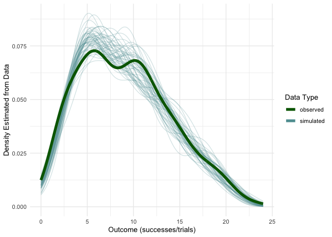<!-- -->

Pretty good agreement here too.

So what does all this mean? Let’s try to understand on particular set of
covariates: if we set the discrete covariate to ‘a’, the continuous
covariate to 1, and have 10 trials, what are posterior predictions for
the number of successes under each condition, and what is their
difference?

``` r
x_disc_cov<-'a'
x_cont_cov<-1
x_trials <-10

drawsDF %>%
  mutate(
    lin_pred_c = c_cond_ctrl+c_disc_cov_a+c_cont_cov*1,
    lin_pred_t = c_cond_trtmt+c_disc_cov_a+c_cont_cov*1,
    prob_c = 1 / (1 + exp(-lin_pred_c)),
    prob_t = 1 / (1 + exp(-lin_pred_t)),
    s_c = rbinom(nrow(.), 10, prob_c),
    s_t = rbinom(nrow(.), 10, prob_t),
    dif=s_t-s_c
  ) %>%
  select(s_c,s_t,dif)%>%
  pivot_longer(cols=everything()) %>%
  mutate(name=case_when(
    name=='s_c'~ 'Successes (Control)', 
    name=='s_t'~ 'Successes (Treatment)', 
    name=='dif'~ 'Difference (Treatment - Control)', 
    ))%>%
  ggplot(aes( x = value))+
  geom_histogram()+
  theme_minimal()+
  labs( x = 'Value', y = 'Count')+
  facet_wrap(~name, nrow = 3)
```

    ## `stat_bin()` using `bins = 30`. Pick better value with `binwidth`.

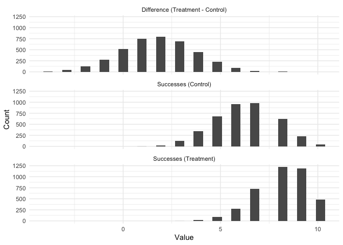<!-- -->

# A more compplicated model

What if the success probability depends on the interaction between the
condition and the discrete covariate, rather than just additively? A
small adjustment to the graph takes care of that easily.

``` r
graph <- dag_create() %>%
  dag_node("Successes", "s", rhs = binomial(trials, prob), data = df$successes) %>%
  dag_node("Trials","trials", child = "s", data = df$trials) %>%
  dag_node("prob", "prob", rhs = 1 / (1+exp(-lin_pred)), child = "s") %>%
  dag_node("lin_pred", "lin_pred", rhs = mu+cont_cov*cont_coef, child = "prob") %>%  
  dag_node("cont_coef", "cont_coef", rhs = normal(0,1), child = "lin_pred") %>%
  dag_node("Cont Cov","cont_cov", child = "lin_pred", data = df$cont_cov) %>%    
  dag_node("mu", "mu", rhs = normal(0,1), child = "lin_pred") %>%
  dag_plate("Condition Effect", "i", nodeLabels = c("mu"), data = df$cond, addDataNode = TRUE) %>%
  dag_plate("Covariate Effect", "j", nodeLabels = c("mu"), data = df$disc_cov, addDataNode = TRUE) %>%
  dag_plate("Observation","o", nodeLabels = c("s","i","j","trials","prob","lin_pred","cont_cov"))
graph %>% dag_render()
```

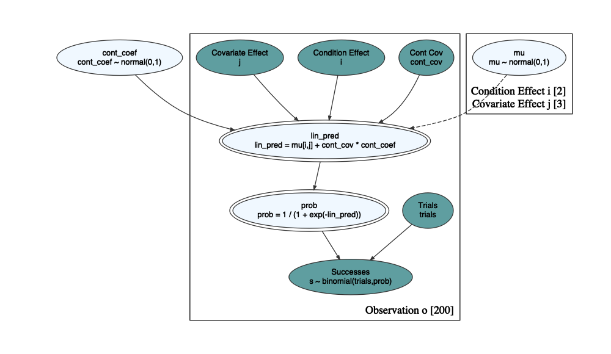<!-- -->

``` r
drawsDF <- graph %>% dag_numpyro()
drawsDF %>% dagp_plot()
```

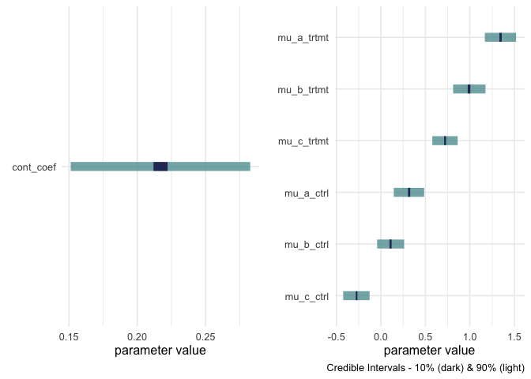<!-- -->

``` r
drawsDF %>% mcmc_trace()
```

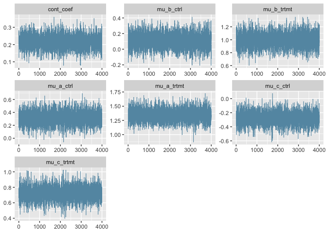<!-- -->

# Beta model

I confess - i never liked logistic regression. I have no ‘feel’ for the
transformations required. For some reason I do think I understand the
beta distribution better, so we’ll try to understand the same data here
using a beta model. We’ll model the probability of success as a beta
with parameters depending on covariates.

First we need some utility functions to go between various
parametrizations of the beta.

``` r
ab_2_muphi <- function(a, b) {
  list(
    mu = a / (a + b),
    phi = a + b
  )
}

muphi_2_ab <- function(mu, phi) {
  list(
    a = mu * phi,
    b = (1 - mu) * phi
  )
}

ab_2_musigma <- function(a, b) {
  list(
    mu = a / (a + b),
    sigma = sqrt(a * b / (a + b)^2 / (a + b + 1))
  )
}

musigma_2_ab <- function(mu, sigma) {
  list(
    a = (mu^2 - mu^3 - mu * sigma^2) / sigma^2,
    b = (mu - 1) * (sigma^2 - mu + mu^2) / sigma^2
  )
}

muphi_musigma <- function(mu, phi) {
  p1 <- muphi_2_ab(mu, phi)
  p2 <- ab_2_musigma(p1$a, p1$b)
  list(mu = p2$mu, sigma = p2$sigma)
}

musigma_muphi <- function(mu, sigma) {
  p1 <- musigma_2_ab(mu, sigma)
  p2 <- ab_2_muphi(p1$a, p1$b)
  list(
    mu = p2$mu,
    phi = p2$phi
  )
}
```

To get started lets build a really simple model….the coefficients of the
beta distribution depend just on the condition. That’s it.

``` r
graph <- dag_create() %>%
  dag_node("Successes","s", rhs = binomial(trials,prob), data = df$successes) %>%
  dag_node("Probability","prob", child = "s", rhs =  beta(a,b)) %>%
  dag_node("a","a", child = "prob", rhs =  exponential(1)) %>%
  dag_node("b","b", child = "prob", rhs =  exponential(1)) %>%  
  dag_node("Trials","trials", child = "s", data = df$trials) %>%
  dag_plate("Cond","cond", nodeLabels = c("a","b"), data = df$cond, addDataNode = TRUE) %>%  
  dag_plate("Observation","i", nodeLabels = c("s","trials","prob","cond"))
graph %>% dag_render()
```

<!-- -->

Why did we use exponential(1) priors? Well we need positive numbers for
the coefficients, so the exponential distribution is a reasonable
choice. Why with parameter 1? An exponential(1) has mean 1, and a
beta(1,1) is uniform…so it seems reasonable.

``` r
drawsDF <- graph %>% dag_numpyro()

drawsDF %>% dagp_plot()
```

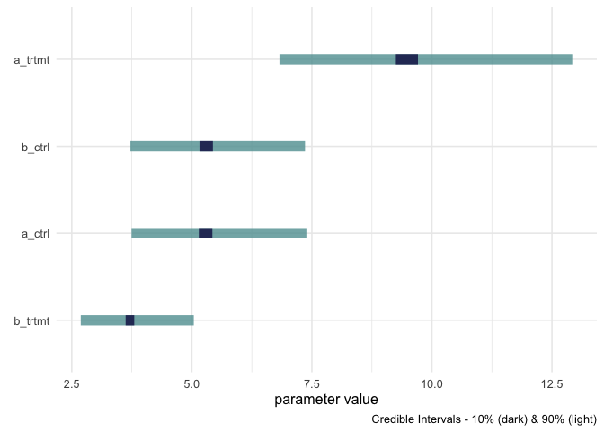<!-- -->

``` r
drawsDF %>% mcmc_trace()
```

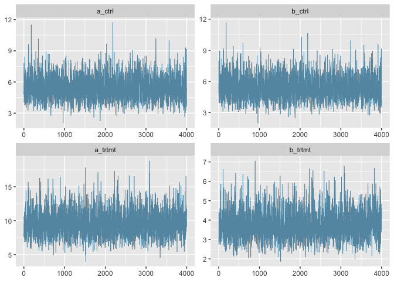<!-- -->

Next we pull out the four coefficients and map them via the
transformations above to something easier to understand.

``` r
drawsDF %>%
  mutate(
    ctrl = map2(a_ctrl,b_ctrl,ab_2_musigma),
    trtmt = map2(a_trtmt,b_trtmt,ab_2_musigma)
  ) %>%
  unnest_wider(ctrl:trtmt, names_sep="_") %>%
  select(ctrl_mu:trtmt_sigma)%>%
  pivot_longer(cols=everything()) %>%  
  ggplot(aes( x = value))+
  geom_histogram()+
  facet_wrap(~name, nrow=2)+
  theme_minimal()
```

    ## `stat_bin()` using `bins = 30`. Pick better value with `binwidth`.

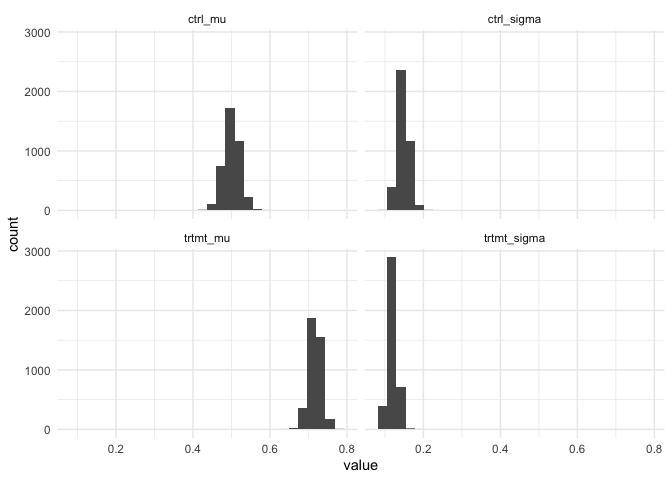<!-- -->

Nice!

To pave the way to add in covariates we add in a linear predictor for
the two coefficients of the beta distribution. It took few trials to get
the graph right. I couldn’t get it, but Adam to the rescue! He suggested
using the dag_node(“Condition”) and dag_edge(“cond”) constructs near the
end of the code.

``` r
graph <- dag_create() %>% 
  dag_node("Successes", "s", rhs = binomial(trials, prob), data = df$successes) %>% 
  dag_node("Probability", "prob", child = "s", rhs = beta(lin_pred_a, lin_pred_b)) %>% 
  dag_node("Linear Predictor A", "lin_pred_a", rhs = c_cond_a, child = "prob") %>% 
  dag_node("Linear Predictor B", "lin_pred_b", rhs = c_cond_b, child = "prob") %>% 
  dag_node("Cond Coefficient A", "c_cond_a", rhs = exponential(1), child = c("lin_pred_a")) %>% 
  dag_node("Cond Coefficient B", "c_cond_b", rhs = exponential(1), child = c("lin_pred_b")) %>%
  dag_node("Trials", "trials", child = "s", data = df$trials) %>%
  dag_plate("Cond", "cond", nodeLabels = c("c_cond_a", "c_cond_b"), data = df$cond, addDataNode = FALSE) %>% 
  dag_node("Condition","cond", data = df$cond) %>% 
  dag_edge("cond",c("lin_pred_a","lin_pred_b")) %>% 
  dag_plate("Observation", "i", nodeLabels = c("s", "trials", "prob", "lin_pred_a", "lin_pred_b","cond")) 

# to make things work w github to get a larger pic
plt <- graph %>% dag_render() 

plt %>%
  DiagrammeRsvg::export_svg() %>%
  xml2::read_xml() %>%
  xml2::write_xml("plt_1.svg")
```

<div style="width: 300%">

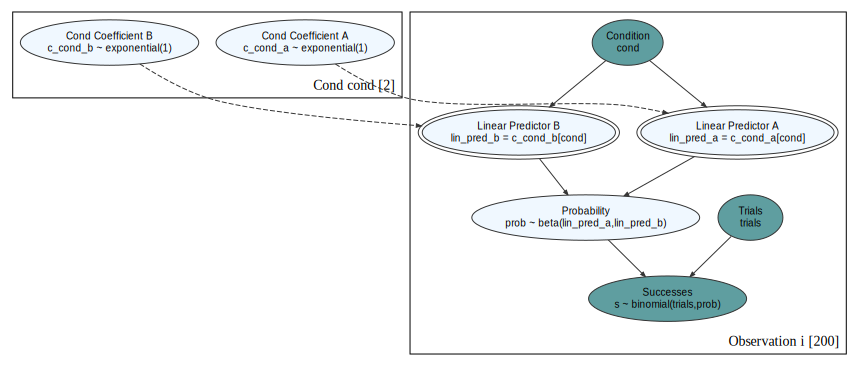

</div>

``` r
drawsDF <- graph %>% dag_numpyro()
drawsDF %>% dagp_plot()
```

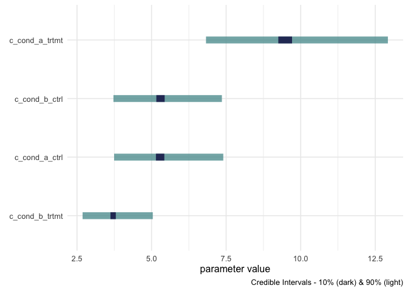<!-- -->

Next we’ll want to add back in the discrete covariate (but we will have
the discrete covariate be independent of the experimental conditions
here)

``` r
graph <- dag_create() %>% 
  dag_node("Successes", "s", rhs = binomial(trials, prob), data = df$successes) %>% 
  dag_node("Probability", "prob", child = "s", rhs = beta(lin_pred_alpha, lin_pred_beta)) %>% 
  dag_node("Linear Predictor Alpha", "lin_pred_alpha", rhs = c_cond_alpha+c_cov_alpha, child = "prob") %>% 
  dag_node("Linear Predictor Beta", "lin_pred_beta", rhs = c_cond_beta+c_cov_beta, child = "prob") %>% 
  dag_node("Cond Coefficient Alpha", "c_cond_alpha", rhs = exponential(1), child = c("lin_pred_alpha")) %>% 
  dag_node("Cond Coefficient Beta", "c_cond_beta", rhs = exponential(1), child = c("lin_pred_beta")) %>%
  dag_node("Cov Coefficient Alpha", "c_cov_alpha", rhs = exponential(1), child = c("lin_pred_alpha")) %>% 
  dag_node("Cov Coefficient Beta", "c_cov_beta", rhs = exponential(1), child = c("lin_pred_beta")) %>%
  dag_node("Trials", "trials", child = "s", data = df$trials) %>%
  dag_plate("Cond", "cond", nodeLabels = c("c_cond_alpha", "c_cond_beta"), data = df$cond, addDataNode = FALSE) %>% 
  dag_plate("Cov", "cov", nodeLabels = c("c_cov_alpha", "c_cov_beta"), data = df$disc_cov, addDataNode = FALSE) %>% 
  dag_node("Condition","cond", data = df$cond) %>%
  dag_node("Cov","cov", data = df$disc_cov) %>%   
  dag_edge("cond",c("lin_pred_alpha","lin_pred_beta")) %>%
  dag_edge("cov",c("lin_pred_alpha","lin_pred_beta")) %>%   
  dag_plate("Observation", "i", nodeLabels = c("s", "trials", "prob", "lin_pred_alpha", "lin_pred_beta","cond","cov")) 

plt <- graph %>% dag_render() 

plt %>%
  DiagrammeRsvg::export_svg() %>%
  xml2::read_xml() %>%
  xml2::write_xml("plt_2.svg")
```

<div style="width: 300%">


</div>

``` r
drawsDF <- graph %>% dag_numpyro()
```

The plot with all the parameters is getting a bit large, so we’ll split
into two.

``` r
drawsDF %>% select(contains("cond")) %>% dagp_plot()
```

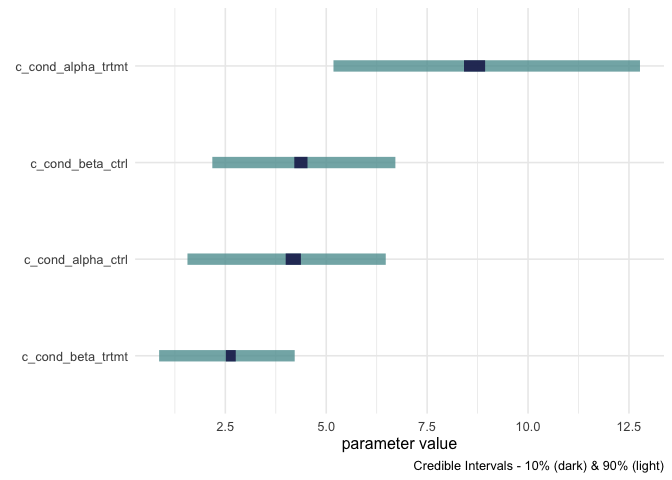<!-- -->

``` r
drawsDF %>% select(contains("cov")) %>% dagp_plot()
```

<!-- -->

Finally, we’ll want to add in the continuous covariate

This is a little more complicated because we need the linear predictor
to be a positive number, and if the input (the continuous covariate) is
negative and its coefficient is positive (or vice-versa) the predictor
could be negative. So we need to ensure it is positive….how to to that?
Rather than feeding in the raw covariate, we could feed in the
exponential of it…that will keep it positive. But, taking the
exponential of a moderately large number may yield overflow (eg
exp(100)), so we’ll center & scale these continuous variables. Note in
our example the continuous covariate was already centered & scaled.

``` r
graph <- dag_create() %>% 
  dag_node("Successes", "s", rhs = binomial(trials, prob), data = df$successes) %>% 
  dag_node("Probability", "prob", child = "s", rhs = beta(lin_pred_alpha, lin_pred_beta)) %>% 
  dag_node("Linear Predictor Alpha", "lin_pred_alpha", rhs = c_cond_alpha+c_cov_alpha+cont_cov*cont_cov, child = "prob") %>% 
  dag_node("Linear Predictor Beta", "lin_pred_beta", rhs = c_cond_beta+c_cov_beta+cont_cov*cont_cov, child = "prob") %>% 
  dag_node("Cond Coefficient Alpha", "c_cond_alpha", rhs = exponential(1), child = c("lin_pred_alpha")) %>% 
  dag_node("Cond Coefficient Beta", "c_cond_beta", rhs = exponential(1), child = c("lin_pred_beta")) %>%
  dag_node("Cov Coefficient Alpha", "c_cov_alpha", rhs = exponential(1), child = c("lin_pred_alpha")) %>% 
  dag_node("Cov Coefficient Beta", "c_cov_beta", rhs = exponential(1), child = c("lin_pred_beta")) %>%
  dag_node("Cont Coeff Alpha","c_cont_cov_alpha", rhs = exponential(1), child = "lin_pred_alpha") %>%  
  dag_node("Cont Coeff Beta","c_cont_cov_beta", rhs = exponential(1), child = "lin_pred_beta") %>%      
  dag_node("Trials", "trials", child = "s", data = df$trials) %>%
  dag_plate("Cond", "cond", nodeLabels = c("c_cond_alpha", "c_cond_beta"), data = df$cond, addDataNode = FALSE) %>% 
  dag_plate("Cov", "cov", nodeLabels = c("c_cov_alpha", "c_cov_beta"), data = df$disc_cov, addDataNode = FALSE) %>% 
  dag_node("Condition","cond", data = df$cond) %>%
  dag_node("Cov","cov", data = df$disc_cov) %>%
  dag_node("Cont Cov","cont", data = exp(df$cont_cov)) %>%     
  dag_edge("cond",c("lin_pred_alpha","lin_pred_beta")) %>%
  dag_edge("cov",c("lin_pred_alpha","lin_pred_beta")) %>%   
  dag_edge("cont",c("lin_pred_alpha","lin_pred_beta")) %>%     
  dag_plate("Observation", "i", nodeLabels = c("s", "trials", "prob", "lin_pred_alpha", "lin_pred_beta","cond","cov","cont")) 

plt <- graph %>% dag_render() # perfect!

plt %>%
  DiagrammeRsvg::export_svg() %>%
  xml2::read_xml() %>%
  xml2::write_xml("plt_3.svg")
```

<div style="width: 300%">


</div>

``` r
drawsDF <- graph %>% dag_numpyro()
```

And we’ll split out the plots again.

``` r
drawsDF %>% select(contains("cond")) %>% dagp_plot()
```

<!-- -->

``` r
drawsDF %>% select(contains("c_cov")) %>% dagp_plot()
```

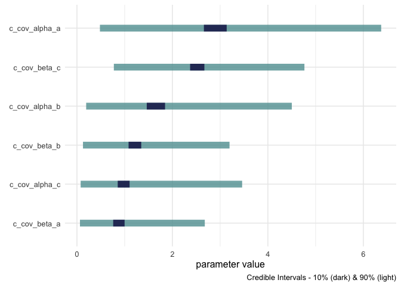<!-- -->

``` r
drawsDF %>% select(contains("c_cont")) %>% dagp_plot()
```

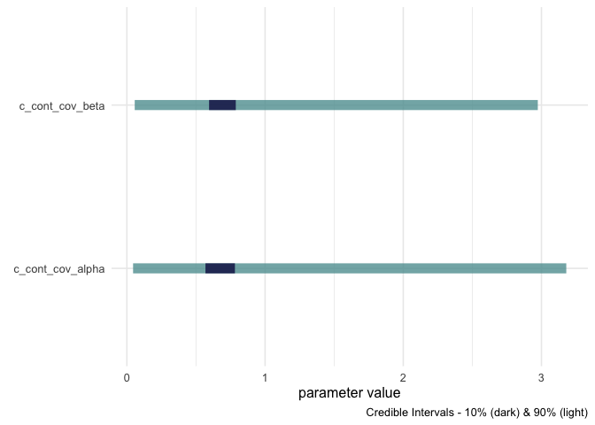<!-- -->

Again, we can manipulate the drawsDF tibble to get anything we might
need

``` r
drawsDF %>%
  mutate(
    ctrl = map2(c_cond_alpha_ctrl,c_cond_beta_ctrl,ab_2_musigma),
    trtmt = map2(c_cond_alpha_trtmt,c_cond_beta_trtmt,ab_2_musigma)
  ) %>%
  unnest_wider(ctrl:trtmt, names_sep="_") %>%
  select(ctrl_mu:trtmt_sigma)%>%
  pivot_longer(cols=everything()) %>%  
  ggplot(aes( x = value))+
  geom_histogram()+
  facet_wrap(~name, nrow=2)+
  theme_minimal()
```

    ## `stat_bin()` using `bins = 30`. Pick better value with `binwidth`.

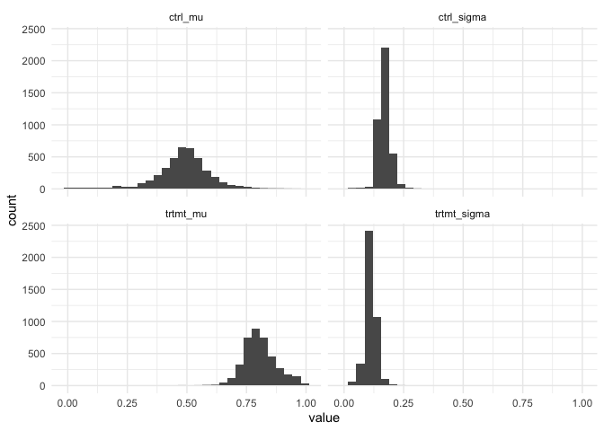<!-- -->

``` r
drawsDF %>%
  mutate(
    cov_a = map2(c_cov_alpha_a,c_cov_beta_a,ab_2_musigma),
    cov_b = map2(c_cov_alpha_b,c_cov_beta_b,ab_2_musigma),
    cov_c = map2(c_cov_alpha_c,c_cov_beta_c,ab_2_musigma),    
  ) %>%
  unnest_wider(cov_a:cov_c, names_sep="_") %>%
  select(cov_a_mu:cov_c_sigma)%>%
  pivot_longer(cols=everything()) %>%  
  ggplot(aes( x = value))+
  geom_histogram()+
  facet_wrap(~name, nrow=3)+
  theme_minimal()
```

    ## `stat_bin()` using `bins = 30`. Pick better value with `binwidth`.

<!-- -->

``` r
drawsDF %>%
  mutate(
    cont = map2(c_cont_cov_alpha,c_cont_cov_beta,ab_2_musigma)
  ) %>%
  unnest_wider(cont,names_sep="_") %>%
  select(cont_mu:cont_sigma)%>%
  pivot_longer(cols=everything()) %>%  
  ggplot(aes( x = value))+
  geom_histogram()+
  facet_wrap(~name, nrow=1)+
  theme_minimal()
```

    ## `stat_bin()` using `bins = 30`. Pick better value with `binwidth`.

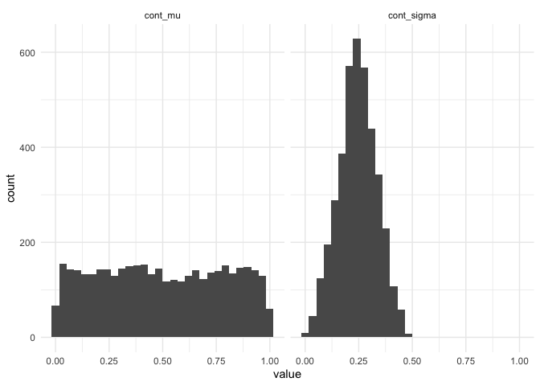<!-- -->

# Posterior Predictive

Finally we’ll look at the posterior predictive of each condition to see
the differences.

``` r
nSamples <- 100

drawsDFp<-drawsDF %>% slice_sample(n=nSamples) %>%
  select(contains("cond"))

pl<-ggplot()+xlim(0, 1)

for(i in 1:nSamples){
pl<-pl+geom_function(fun = dbeta, args = list(shape1 = drawsDFp$c_cond_alpha_ctrl[i], shape2 = drawsDFp$c_cond_beta_ctrl[i]), alpha=0.1)
}

p_ctrl<-pl+theme_minimal()

pl<-ggplot()+xlim(0, 1)

for(i in 1:nSamples){
pl<-pl+geom_function(fun = dbeta, args = list(shape1 = drawsDFp$c_cond_alpha_trtmt[i], shape2 = drawsDFp$c_cond_beta_trtmt[i]), alpha=0.1)
}

p_trtmt<-pl+theme_minimal()

p_ctrl/p_trtmt
```

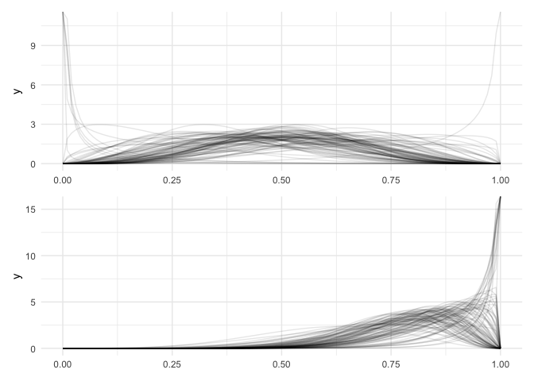<!-- -->

# Appendices

<details>
<summary>

References

</summary>

[greta](https://greta-stats.org/index.html)  
[causact](https://www.causact.com/)

</details>
<details>
<summary>

SessionInfo

</summary>

``` r
sessionInfo()
```

    ## R version 4.2.2 (2022-10-31)
    ## Platform: x86_64-apple-darwin17.0 (64-bit)
    ## Running under: macOS Big Sur ... 10.16
    ## 
    ## Matrix products: default
    ## BLAS:   /Library/Frameworks/R.framework/Versions/4.2/Resources/lib/libRblas.0.dylib
    ## LAPACK: /Library/Frameworks/R.framework/Versions/4.2/Resources/lib/libRlapack.dylib
    ## 
    ## locale:
    ## [1] en_US.UTF-8/en_US.UTF-8/en_US.UTF-8/C/en_US.UTF-8/en_US.UTF-8
    ## 
    ## attached base packages:
    ## [1] stats     graphics  grDevices utils     datasets  methods   base     
    ## 
    ## other attached packages:
    ##  [1] causact_0.5.3    patchwork_1.1.2  ggridges_0.5.4   bayesplot_1.10.0
    ##  [5] lubridate_1.9.2  forcats_1.0.0    stringr_1.5.0    dplyr_1.1.2     
    ##  [9] purrr_1.0.2      readr_2.1.4      tidyr_1.3.0      tibble_3.2.1    
    ## [13] ggplot2_3.4.2    tidyverse_2.0.0 
    ## 
    ## loaded via a namespace (and not attached):
    ##  [1] jsonlite_1.8.7         posterior_1.4.1        distributional_0.3.2  
    ##  [4] highr_0.10             tensorA_0.36.2         yaml_2.3.7            
    ##  [7] pillar_1.9.0           backports_1.4.1        lattice_0.20-45       
    ## [10] glue_1.6.2             reticulate_1.31        digest_0.6.33         
    ## [13] RColorBrewer_1.1-3     checkmate_2.1.0        colorspace_2.1-0      
    ## [16] cowplot_1.1.1          htmltools_0.5.6        Matrix_1.5-3          
    ## [19] plyr_1.8.8             pkgconfig_2.0.3        DiagrammeR_1.0.10     
    ## [22] scales_1.2.1           marginaleffects_0.13.0 webshot_0.5.4         
    ## [25] processx_3.8.0         tzdb_0.4.0             timechange_0.2.0      
    ## [28] generics_0.1.3         farver_2.1.1           ellipsis_0.3.2        
    ## [31] withr_2.5.0            cli_3.6.1              magrittr_2.0.3        
    ## [34] evaluate_0.21          ps_1.7.4               fansi_1.0.4           
    ## [37] xml2_1.3.3             tools_4.2.2            data.table_1.14.8     
    ## [40] hms_1.1.3              lifecycle_1.0.3        V8_4.2.2              
    ## [43] munsell_0.5.0          callr_3.7.3            compiler_4.2.2        
    ## [46] rlang_1.1.1            grid_4.2.2             rstudioapi_0.15.0     
    ## [49] htmlwidgets_1.6.2      visNetwork_2.1.2       igraph_1.5.1          
    ## [52] labeling_0.4.2         rmarkdown_2.23         gtable_0.3.3          
    ## [55] curl_5.0.0             abind_1.4-5            reshape2_1.4.4        
    ## [58] R6_2.5.1               knitr_1.43             fastmap_1.1.1         
    ## [61] utf8_1.2.3             DiagrammeRsvg_0.1      insight_0.19.3        
    ## [64] stringi_1.7.12         Rcpp_1.0.11            vctrs_0.6.3           
    ## [67] png_0.1-8              tidyselect_1.2.0       xfun_0.40

</details>
