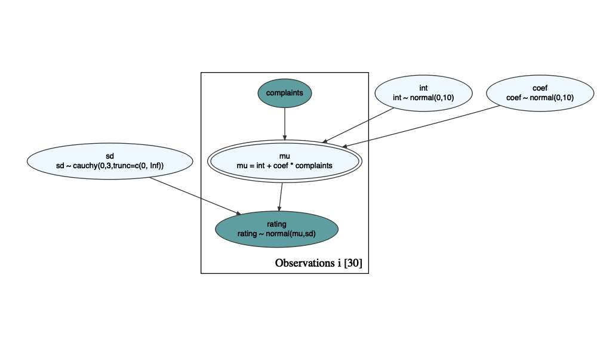
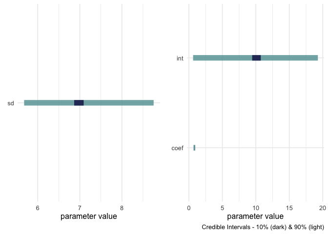
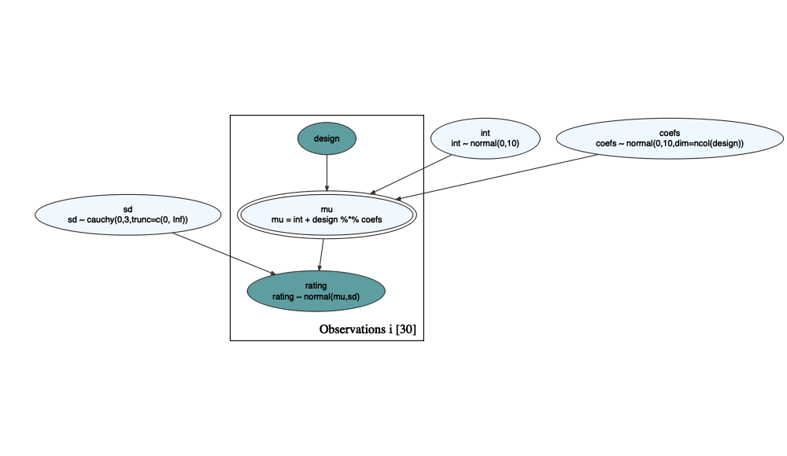
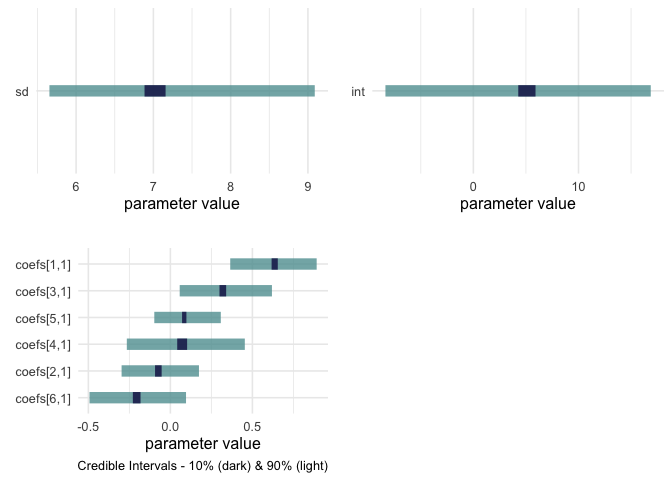
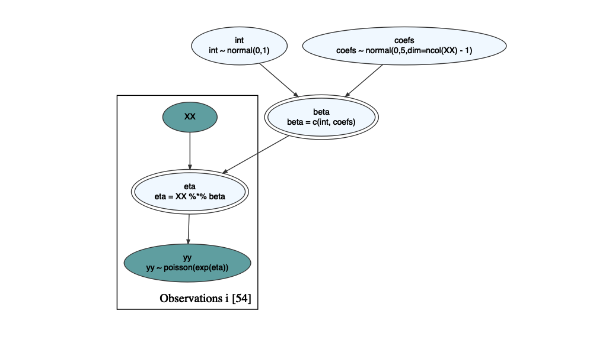
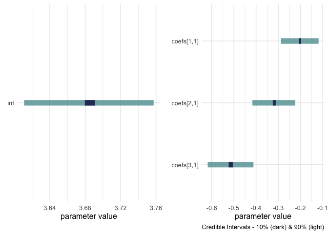
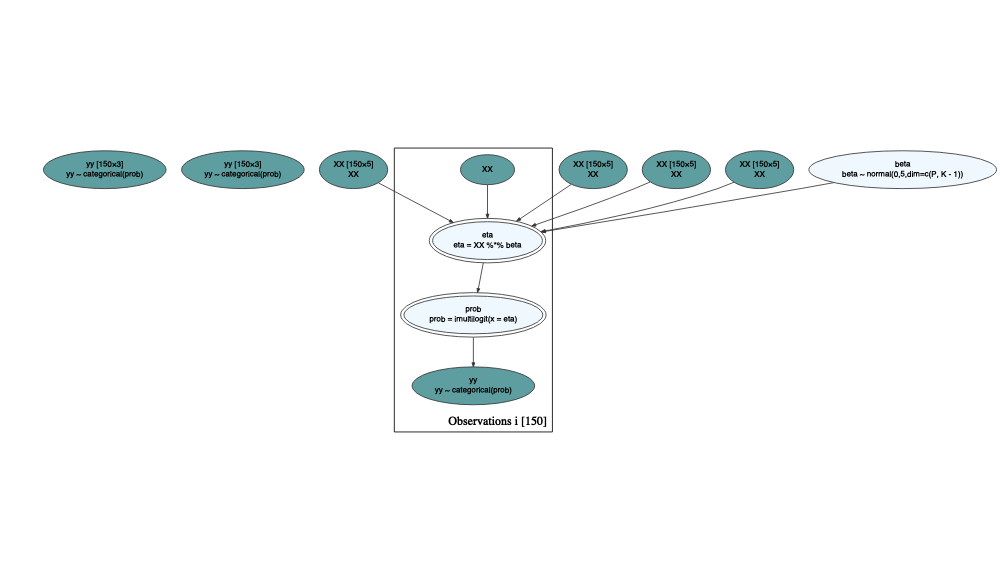
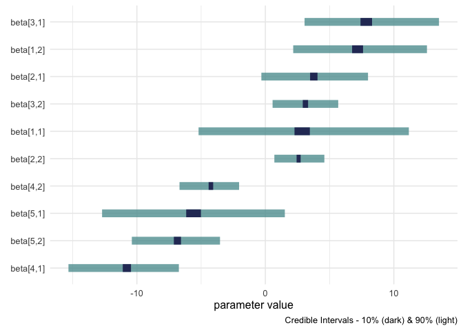
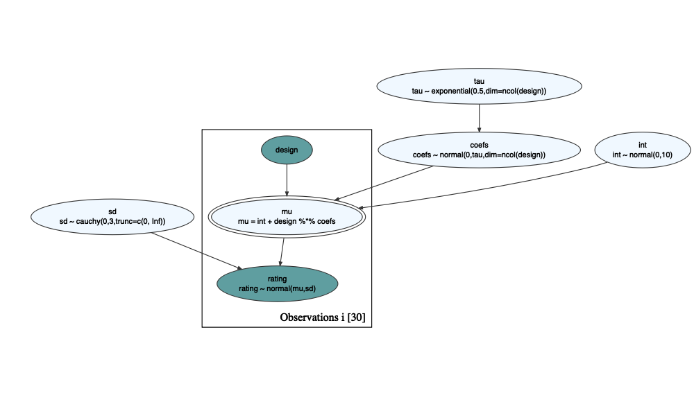
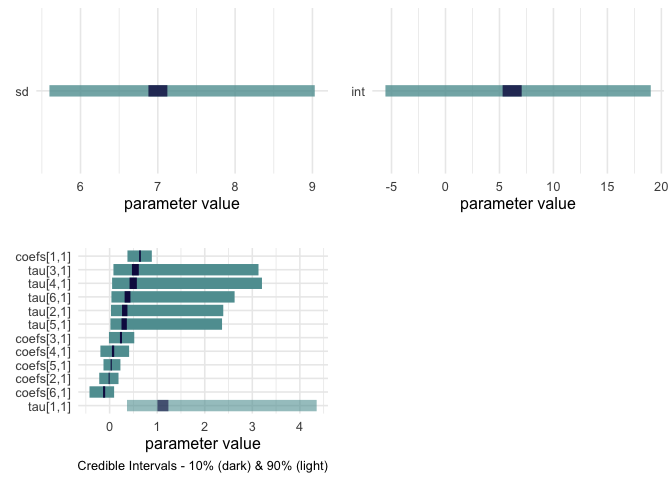

Greta and Causact: Some Examples
================
Peter Rabinovitch
2022-12-28 09:19:42

# Introduction

About a year ago I wrote a
[post](https://prabinov42.github.io/posts/greta_and_causact/) abut using
the *causact* R library, which uses the *greta* library, which uses
*TensorFlow* to estimate Bayesian models.

As I have had spare time I have converted several of the [greta
examples](https://greta-stats.org/articles/example_models.html) into
causact code. I plan to do more as time allows….including cleaning it up
a bit with more explanations.

Each example follows the same pattern: duplicate the greta model from
the examples page, run it and pull out some results. Then repeat the
model in causact, display the graph (love these), and pull out some
results.

``` r
library(tidyverse)
library(knitr)
library(bayesplot)
library(greta)
library(causact)
```

# Example 1: Linear regression

``` r
# A simple, one-variable Bayesian linear regression model using the attitude data

# greta
# variables & priors
data("attitude")
int <- normal(0, 10)
```

    ## ℹ Initialising python and checking dependencies, this may take a moment.✔ Initialising python and checking dependencies ... done!               

``` r
coef <- normal(0, 10)
sd <- cauchy(0, 3, truncation = c(0, Inf))
# linear predictor
mu <- int + coef * attitude$complaints
# observation model
distribution(attitude$rating) <- normal(mu, sd)
gretaModel <- model(int, coef, sd, mu) # MODEL
draws <- mcmc(gretaModel)
```

    ## running 4 chains simultaneously on up to 12 cores

    ##     warmup                                           0/1000 | eta:  ?s              warmup ==                                       50/1000 | eta: 19s | 12% bad    warmup ====                                    100/1000 | eta: 12s | 6% bad     warmup ======                                  150/1000 | eta: 10s | 4% bad     warmup ========                                200/1000 | eta:  9s | 3% bad     warmup ==========                              250/1000 | eta:  8s | 2% bad     warmup ===========                             300/1000 | eta:  7s | 2% bad     warmup =============                           350/1000 | eta:  6s | 2% bad     warmup ===============                         400/1000 | eta:  6s | 2% bad     warmup =================                       450/1000 | eta:  5s | 1% bad     warmup ===================                     500/1000 | eta:  4s | 1% bad     warmup =====================                   550/1000 | eta:  4s | 1% bad     warmup =======================                 600/1000 | eta:  4s | 1% bad     warmup =========================               650/1000 | eta:  3s | <1% bad    warmup ===========================             700/1000 | eta:  3s | <1% bad    warmup ============================            750/1000 | eta:  2s | <1% bad    warmup ==============================          800/1000 | eta:  2s | <1% bad    warmup ================================        850/1000 | eta:  1s | <1% bad    warmup ==================================      900/1000 | eta:  1s | <1% bad    warmup ====================================    950/1000 | eta:  0s | <1% bad    warmup ====================================== 1000/1000 | eta:  0s | <1% bad
    ##   sampling                                           0/1000 | eta:  ?s            sampling ==                                       50/1000 | eta:  6s            sampling ====                                    100/1000 | eta:  6s            sampling ======                                  150/1000 | eta:  5s            sampling ========                                200/1000 | eta:  5s            sampling ==========                              250/1000 | eta:  4s            sampling ===========                             300/1000 | eta:  4s            sampling =============                           350/1000 | eta:  4s            sampling ===============                         400/1000 | eta:  3s            sampling =================                       450/1000 | eta:  3s            sampling ===================                     500/1000 | eta:  3s            sampling =====================                   550/1000 | eta:  3s            sampling =======================                 600/1000 | eta:  2s            sampling =========================               650/1000 | eta:  2s            sampling ===========================             700/1000 | eta:  2s            sampling ============================            750/1000 | eta:  1s            sampling ==============================          800/1000 | eta:  1s            sampling ================================        850/1000 | eta:  1s            sampling ==================================      900/1000 | eta:  1s            sampling ====================================    950/1000 | eta:  0s            sampling ====================================== 1000/1000 | eta:  0s

``` r
tidyDrawsDF <- bind_rows(
  draws$`11` %>% as.matrix() %>% as_tibble() %>% rowid_to_column() %>% mutate(chain = 1) %>%
    pivot_longer(cols = -c(rowid, chain), names_to = "param", values_to = "value"),
  draws$`12` %>% as.matrix() %>% as_tibble() %>% rowid_to_column() %>% mutate(chain = 2) %>%
    pivot_longer(cols = -c(rowid, chain), names_to = "param", values_to = "value"),
  draws$`13` %>% as.matrix() %>% as_tibble() %>% rowid_to_column() %>% mutate(chain = 3) %>%
    pivot_longer(cols = -c(rowid, chain), names_to = "param", values_to = "value"),
  draws$`14` %>% as.matrix() %>% as_tibble() %>% rowid_to_column() %>% mutate(chain = 4) %>%
    pivot_longer(cols = -c(rowid, chain), names_to = "param", values_to = "value")
)

tidyDrawsDF %>%
  pull(param) %>%
  unique()
```

    ##  [1] "int"      "coef"     "sd"       "mu[1,1]"  "mu[2,1]"  "mu[3,1]" 
    ##  [7] "mu[4,1]"  "mu[5,1]"  "mu[6,1]"  "mu[7,1]"  "mu[8,1]"  "mu[9,1]" 
    ## [13] "mu[10,1]" "mu[11,1]" "mu[12,1]" "mu[13,1]" "mu[14,1]" "mu[15,1]"
    ## [19] "mu[16,1]" "mu[17,1]" "mu[18,1]" "mu[19,1]" "mu[20,1]" "mu[21,1]"
    ## [25] "mu[22,1]" "mu[23,1]" "mu[24,1]" "mu[25,1]" "mu[26,1]" "mu[27,1]"
    ## [31] "mu[28,1]" "mu[29,1]" "mu[30,1]"

``` r
tidyDrawsDF %>%
  filter(param == "coef") %>%
  pull(value) %>%
  mean()
```

    ## [1] 0.8116632

``` r
tidyDrawsDF %>%
  filter(param == "int") %>%
  pull(value) %>%
  mean()
```

    ## [1] 10.39959

``` r
tidyDrawsDF %>%
  filter(param == "sd") %>%
  pull(value) %>%
  mean()
```

    ## [1] 7.086549

``` r
# causact
df <- attitude %>% select(rating, complaints)
graph <- dag_create() %>%
  dag_node("rating", "rating", rhs = normal(mu, sd), data = df$rating) %>%
  dag_node("mu", "mu", rhs = int + coef * complaints, child = "rating") %>%
  dag_node("sd", "sd", rhs = cauchy(0, 3, truncation = c(0, Inf)), child = "rating") %>%
  dag_node("int", "int", rhs = normal(0, 10), child = "mu") %>%
  dag_node("coef", "coef", rhs = normal(0, 10), child = "mu") %>%
  dag_node("complaints", "complaints", data = df$complaints, child = "mu") %>%
  dag_plate("Observations", "i", nodeLabels = c("rating", "complaints", "mu"))
graph %>% dag_render()
```

<!-- -->

``` r
set.seed(2022)
drawsDF <- graph %>% dag_greta(mcmc = TRUE)
```

    ## running 4 chains simultaneously on up to 12 cores

    ##     warmup                                           0/1000 | eta:  ?s              warmup ==                                       50/1000 | eta: 17s | 12% bad    warmup ====                                    100/1000 | eta: 12s | 6% bad     warmup ======                                  150/1000 | eta:  9s | 4% bad     warmup ========                                200/1000 | eta:  8s | 3% bad     warmup ==========                              250/1000 | eta:  7s | 2% bad     warmup ===========                             300/1000 | eta:  7s | 2% bad     warmup =============                           350/1000 | eta:  6s | 2% bad     warmup ===============                         400/1000 | eta:  5s | 2% bad     warmup =================                       450/1000 | eta:  5s | 1% bad     warmup ===================                     500/1000 | eta:  4s | 1% bad     warmup =====================                   550/1000 | eta:  4s | 1% bad     warmup =======================                 600/1000 | eta:  3s | 1% bad     warmup =========================               650/1000 | eta:  3s | <1% bad    warmup ===========================             700/1000 | eta:  2s | <1% bad    warmup ============================            750/1000 | eta:  2s | <1% bad    warmup ==============================          800/1000 | eta:  2s | <1% bad    warmup ================================        850/1000 | eta:  1s | <1% bad    warmup ==================================      900/1000 | eta:  1s | <1% bad    warmup ====================================    950/1000 | eta:  0s | <1% bad    warmup ====================================== 1000/1000 | eta:  0s | <1% bad
    ##   sampling                                           0/1000 | eta:  ?s            sampling ==                                       50/1000 | eta:  4s            sampling ====                                    100/1000 | eta:  5s            sampling ======                                  150/1000 | eta:  5s            sampling ========                                200/1000 | eta:  4s            sampling ==========                              250/1000 | eta:  4s            sampling ===========                             300/1000 | eta:  4s            sampling =============                           350/1000 | eta:  3s            sampling ===============                         400/1000 | eta:  3s            sampling =================                       450/1000 | eta:  3s            sampling ===================                     500/1000 | eta:  3s            sampling =====================                   550/1000 | eta:  3s            sampling =======================                 600/1000 | eta:  2s            sampling =========================               650/1000 | eta:  2s            sampling ===========================             700/1000 | eta:  2s            sampling ============================            750/1000 | eta:  1s            sampling ==============================          800/1000 | eta:  1s            sampling ================================        850/1000 | eta:  1s            sampling ==================================      900/1000 | eta:  1s            sampling ====================================    950/1000 | eta:  0s            sampling ====================================== 1000/1000 | eta:  0s

``` r
drawsDF %>% dagp_plot()
```

<!-- -->

# Example 2: Multiple linear regression

``` r
# A multi-variable Bayesian linear regression model using the attitude data
# greta
data(attitude)
design <- as.matrix(attitude[, 2:7])
int <- normal(0, 10)
coefs <- normal(0, 10, dim = ncol(design))
sd <- cauchy(0, 3, truncation = c(0, Inf))
# matrix multiplication is more efficient than multiplying the coefficients
# separately
mu <- int + design %*% coefs
distribution(attitude$rating) <- normal(mu, sd)
gretaModel <- model(int, coefs, sd) # MODEL
draws <- mcmc(gretaModel)
```

    ## running 4 chains simultaneously on up to 12 cores

    ## 

    ##     warmup                                           0/1000 | eta:  ?s              warmup ==                                       50/1000 | eta: 17s | 6% bad     warmup ====                                    100/1000 | eta: 12s | 3% bad     warmup ======                                  150/1000 | eta: 10s | 2% bad     warmup ========                                200/1000 | eta:  8s | 2% bad     warmup ==========                              250/1000 | eta:  7s | 1% bad     warmup ===========                             300/1000 | eta:  7s | 1% bad     warmup =============                           350/1000 | eta:  6s | <1% bad    warmup ===============                         400/1000 | eta:  5s | <1% bad    warmup =================                       450/1000 | eta:  5s | <1% bad    warmup ===================                     500/1000 | eta:  4s | <1% bad    warmup =====================                   550/1000 | eta:  4s | <1% bad    warmup =======================                 600/1000 | eta:  3s | <1% bad    warmup =========================               650/1000 | eta:  3s | <1% bad    warmup ===========================             700/1000 | eta:  3s | <1% bad    warmup ============================            750/1000 | eta:  2s | <1% bad    warmup ==============================          800/1000 | eta:  2s | <1% bad    warmup ================================        850/1000 | eta:  1s | <1% bad    warmup ==================================      900/1000 | eta:  1s | <1% bad    warmup ====================================    950/1000 | eta:  0s | <1% bad    warmup ====================================== 1000/1000 | eta:  0s | <1% bad
    ##   sampling                                           0/1000 | eta:  ?s            sampling ==                                       50/1000 | eta:  5s            sampling ====                                    100/1000 | eta:  6s            sampling ======                                  150/1000 | eta:  5s            sampling ========                                200/1000 | eta:  5s            sampling ==========                              250/1000 | eta:  5s            sampling ===========                             300/1000 | eta:  4s            sampling =============                           350/1000 | eta:  4s            sampling ===============                         400/1000 | eta:  4s            sampling =================                       450/1000 | eta:  3s            sampling ===================                     500/1000 | eta:  3s            sampling =====================                   550/1000 | eta:  3s            sampling =======================                 600/1000 | eta:  3s            sampling =========================               650/1000 | eta:  2s            sampling ===========================             700/1000 | eta:  2s            sampling ============================            750/1000 | eta:  2s            sampling ==============================          800/1000 | eta:  1s            sampling ================================        850/1000 | eta:  1s            sampling ==================================      900/1000 | eta:  1s            sampling ====================================    950/1000 | eta:  0s            sampling ====================================== 1000/1000 | eta:  0s

``` r
tidyDrawsDF <- replaceLabels(draws) %>%
  as.matrix() %>%
  as_tibble() %>%
  addPriorGroups()
tidyDrawsDF %>% glimpse()
```

    ## Rows: 32,000
    ## Columns: 3
    ## $ param      <chr> "sd", "sd", "sd", "sd", "sd", "sd", "sd", "sd", "sd", "sd",…
    ## $ value      <dbl> 6.148830, 8.175318, 6.630982, 7.111410, 8.036355, 7.462776,…
    ## $ priorGroup <int> 1, 1, 1, 1, 1, 1, 1, 1, 1, 1, 1, 1, 1, 1, 1, 1, 1, 1, 1, 1,…

``` r
tidyDrawsDF %>%
  pull(param) %>%
  unique()
```

    ## [1] "sd"         "int"        "coefs[1,1]" "coefs[2,1]" "coefs[3,1]"
    ## [6] "coefs[4,1]" "coefs[5,1]" "coefs[6,1]"

``` r
tidyDrawsDF %>%
  filter(param == "coefs[1,1]") %>%
  pull(value) %>%
  mean()
```

    ## [1] 0.614694

``` r
tidyDrawsDF %>%
  filter(param == "coefs[6,1]") %>%
  pull(value) %>%
  mean()
```

    ## [1] -0.2222883

``` r
tidyDrawsDF %>%
  filter(param == "int") %>%
  pull(value) %>%
  mean()
```

    ## [1] 6.718339

``` r
tidyDrawsDF %>%
  filter(param == "sd") %>%
  pull(value) %>%
  mean()
```

    ## [1] 7.138928

``` r
tidyDrawsDF <- bind_rows(
  draws$`11` %>% as.matrix() %>% as_tibble() %>% rowid_to_column() %>% mutate(chain = 1) %>%
    pivot_longer(cols = -c(rowid, chain), names_to = "param", values_to = "value"),
  draws$`12` %>% as.matrix() %>% as_tibble() %>% rowid_to_column() %>% mutate(chain = 2) %>%
    pivot_longer(cols = -c(rowid, chain), names_to = "param", values_to = "value"),
  draws$`13` %>% as.matrix() %>% as_tibble() %>% rowid_to_column() %>% mutate(chain = 3) %>%
    pivot_longer(cols = -c(rowid, chain), names_to = "param", values_to = "value"),
  draws$`14` %>% as.matrix() %>% as_tibble() %>% rowid_to_column() %>% mutate(chain = 4) %>%
    pivot_longer(cols = -c(rowid, chain), names_to = "param", values_to = "value")
)

# causact
design <- as.matrix(attitude[, 2:7])
graph <- dag_create() %>%
  dag_node("rating", "rating", rhs = normal(mu, sd), data = df$rating) %>%
  dag_node("mu", "mu", rhs = int + design %*% coefs, child = "rating") %>%
  dag_node("sd", "sd", rhs = cauchy(0, 3, truncation = c(0, Inf)), child = "rating") %>%
  dag_node("int", "int", rhs = normal(0, 10), child = "mu") %>%
  dag_node("coefs", "coefs", rhs = normal(0, 10, dim = ncol(design)), child = "mu") %>%
  dag_node("design", "design", data = design, child = "mu", keepAsDF = TRUE) %>%
  dag_plate("Observations", "i", nodeLabels = c("rating", "design", "mu"))
graph %>% dag_render()
```

<!-- -->

``` r
set.seed(2022)
drawsDF <- graph %>% dag_greta(mcmc = TRUE)
```

    ## running 4 chains simultaneously on up to 12 cores

    ##     warmup                                           0/1000 | eta:  ?s              warmup ==                                       50/1000 | eta: 18s | 2% bad     warmup ====                                    100/1000 | eta: 12s | <1% bad    warmup ======                                  150/1000 | eta: 10s | <1% bad    warmup ========                                200/1000 | eta:  8s | <1% bad    warmup ==========                              250/1000 | eta:  8s | <1% bad    warmup ===========                             300/1000 | eta:  7s | <1% bad    warmup =============                           350/1000 | eta:  6s | <1% bad    warmup ===============                         400/1000 | eta:  6s | <1% bad    warmup =================                       450/1000 | eta:  5s | <1% bad    warmup ===================                     500/1000 | eta:  4s | <1% bad    warmup =====================                   550/1000 | eta:  4s | <1% bad    warmup =======================                 600/1000 | eta:  3s | <1% bad    warmup =========================               650/1000 | eta:  3s | <1% bad    warmup ===========================             700/1000 | eta:  3s | <1% bad    warmup ============================            750/1000 | eta:  2s | <1% bad    warmup ==============================          800/1000 | eta:  2s | <1% bad    warmup ================================        850/1000 | eta:  1s | <1% bad    warmup ==================================      900/1000 | eta:  1s | <1% bad    warmup ====================================    950/1000 | eta:  0s | <1% bad    warmup ====================================== 1000/1000 | eta:  0s | <1% bad
    ##   sampling                                           0/1000 | eta:  ?s            sampling ==                                       50/1000 | eta:  4s            sampling ====                                    100/1000 | eta:  5s            sampling ======                                  150/1000 | eta:  5s            sampling ========                                200/1000 | eta:  4s            sampling ==========                              250/1000 | eta:  4s            sampling ===========                             300/1000 | eta:  4s            sampling =============                           350/1000 | eta:  3s            sampling ===============                         400/1000 | eta:  3s            sampling =================                       450/1000 | eta:  3s            sampling ===================                     500/1000 | eta:  3s            sampling =====================                   550/1000 | eta:  3s            sampling =======================                 600/1000 | eta:  2s            sampling =========================               650/1000 | eta:  2s            sampling ===========================             700/1000 | eta:  2s            sampling ============================            750/1000 | eta:  1s            sampling ==============================          800/1000 | eta:  1s            sampling ================================        850/1000 | eta:  1s            sampling ==================================      900/1000 | eta:  1s            sampling ====================================    950/1000 | eta:  0s            sampling ====================================== 1000/1000 | eta:  0s

``` r
drawsDF %>% dagp_plot()
```

<!-- -->

``` r
#
# #or
# graph <- dag_create() %>%
#   dag_node("rating", "rating", rhs = normal(mu, sd), data = df$rating) %>%
#   dag_node("mu", "mu", rhs = int+design %*% coefs, child = "rating") %>%
#   dag_node("sd", "sd", rhs = cauchy(0,3,truncation = c(0, Inf)), child = "rating") %>%
#   dag_node("int", "int", rhs = normal(0,10), child = "mu") %>%
#   dag_node("coefs", "coefs", rhs = normal(0,10, dim=ncol(design)), child = "mu") %>%
#   dag_node("design", "design", data = design, child = "mu") %>%
#   dag_plate("Observations", "i", nodeLabels = c("rating","design","mu"))
```

# Example 3: Multiple Poisson regression

``` r
# A multiple Bayesian linear regression model using the warpbreaks data.
# greta
data("warpbreaks")
X <- as_data(model.matrix(breaks ~ wool + tension, warpbreaks))
y <- as_data(warpbreaks$breaks)
int <- variable()
coefs <- normal(0, 5, dim = ncol(X) - 1)
beta <- c(int, coefs)
eta <- X %*% beta
distribution(y) <- poisson(exp(eta))
gretaModel <- model(int, coefs, eta)
draws <- mcmc(gretaModel)
```

    ## running 4 chains simultaneously on up to 12 cores

    ## 

    ##     warmup                                           0/1000 | eta:  ?s              warmup ==                                       50/1000 | eta: 11s              warmup ====                                    100/1000 | eta:  8s              warmup ======                                  150/1000 | eta:  7s              warmup ========                                200/1000 | eta:  6s              warmup ==========                              250/1000 | eta:  5s              warmup ===========                             300/1000 | eta:  5s              warmup =============                           350/1000 | eta:  5s              warmup ===============                         400/1000 | eta:  4s              warmup =================                       450/1000 | eta:  4s              warmup ===================                     500/1000 | eta:  3s              warmup =====================                   550/1000 | eta:  3s              warmup =======================                 600/1000 | eta:  3s              warmup =========================               650/1000 | eta:  2s              warmup ===========================             700/1000 | eta:  2s              warmup ============================            750/1000 | eta:  2s              warmup ==============================          800/1000 | eta:  1s              warmup ================================        850/1000 | eta:  1s              warmup ==================================      900/1000 | eta:  1s              warmup ====================================    950/1000 | eta:  0s              warmup ====================================== 1000/1000 | eta:  0s          
    ##   sampling                                           0/1000 | eta:  ?s            sampling ==                                       50/1000 | eta:  4s            sampling ====                                    100/1000 | eta:  4s            sampling ======                                  150/1000 | eta:  3s            sampling ========                                200/1000 | eta:  3s            sampling ==========                              250/1000 | eta:  3s            sampling ===========                             300/1000 | eta:  3s            sampling =============                           350/1000 | eta:  2s            sampling ===============                         400/1000 | eta:  2s            sampling =================                       450/1000 | eta:  2s            sampling ===================                     500/1000 | eta:  2s            sampling =====================                   550/1000 | eta:  2s            sampling =======================                 600/1000 | eta:  2s            sampling =========================               650/1000 | eta:  1s            sampling ===========================             700/1000 | eta:  1s            sampling ============================            750/1000 | eta:  1s            sampling ==============================          800/1000 | eta:  1s            sampling ================================        850/1000 | eta:  1s            sampling ==================================      900/1000 | eta:  0s            sampling ====================================    950/1000 | eta:  0s            sampling ====================================== 1000/1000 | eta:  0s

``` r
tidyDrawsDF <- replaceLabels(draws) %>%
  as.matrix() %>%
  as_tibble() %>%
  addPriorGroups()
tidyDrawsDF %>% glimpse()
```

    ## Rows: 232,000
    ## Columns: 3
    ## $ param      <chr> "int", "int", "int", "int", "int", "int", "int", "int", "in…
    ## $ value      <dbl> 3.723282, 3.643865, 3.714504, 3.674405, 3.715477, 3.680699,…
    ## $ priorGroup <int> 2, 2, 2, 2, 2, 2, 2, 2, 2, 2, 2, 2, 2, 2, 2, 2, 2, 2, 2, 2,…

``` r
tidyDrawsDF %>%
  pull(param) %>%
  unique()
```

    ##  [1] "int"        "coefs[1,1]" "coefs[2,1]" "coefs[3,1]" "eta[1,1]"  
    ##  [6] "eta[10,1]"  "eta[11,1]"  "eta[12,1]"  "eta[13,1]"  "eta[14,1]" 
    ## [11] "eta[15,1]"  "eta[16,1]"  "eta[17,1]"  "eta[18,1]"  "eta[19,1]" 
    ## [16] "eta[2,1]"   "eta[20,1]"  "eta[21,1]"  "eta[22,1]"  "eta[23,1]" 
    ## [21] "eta[24,1]"  "eta[25,1]"  "eta[26,1]"  "eta[27,1]"  "eta[28,1]" 
    ## [26] "eta[29,1]"  "eta[3,1]"   "eta[30,1]"  "eta[31,1]"  "eta[32,1]" 
    ## [31] "eta[33,1]"  "eta[34,1]"  "eta[35,1]"  "eta[36,1]"  "eta[37,1]" 
    ## [36] "eta[38,1]"  "eta[39,1]"  "eta[4,1]"   "eta[40,1]"  "eta[41,1]" 
    ## [41] "eta[42,1]"  "eta[43,1]"  "eta[44,1]"  "eta[45,1]"  "eta[46,1]" 
    ## [46] "eta[47,1]"  "eta[48,1]"  "eta[49,1]"  "eta[5,1]"   "eta[50,1]" 
    ## [51] "eta[51,1]"  "eta[52,1]"  "eta[53,1]"  "eta[54,1]"  "eta[6,1]"  
    ## [56] "eta[7,1]"   "eta[8,1]"   "eta[9,1]"

``` r
tidyDrawsDF %>%
  filter(param == "coefs[1,1]") %>%
  pull(value) %>%
  mean()
```

    ## [1] -0.2033595

``` r
tidyDrawsDF %>%
  filter(param == "eta[13,1]") %>%
  pull(value) %>%
  mean()
```

    ## [1] 3.366418

``` r
tidyDrawsDF %>%
  filter(param == "int") %>%
  pull(value) %>%
  mean()
```

    ## [1] 3.689636

``` r
tidyDrawsDF <- bind_rows(
  draws$`11` %>% as.matrix() %>% as_tibble() %>% rowid_to_column() %>% mutate(chain = 1) %>%
    pivot_longer(cols = -c(rowid, chain), names_to = "param", values_to = "value"),
  draws$`12` %>% as.matrix() %>% as_tibble() %>% rowid_to_column() %>% mutate(chain = 2) %>%
    pivot_longer(cols = -c(rowid, chain), names_to = "param", values_to = "value"),
  draws$`13` %>% as.matrix() %>% as_tibble() %>% rowid_to_column() %>% mutate(chain = 3) %>%
    pivot_longer(cols = -c(rowid, chain), names_to = "param", values_to = "value"),
  draws$`14` %>% as.matrix() %>% as_tibble() %>% rowid_to_column() %>% mutate(chain = 4) %>%
    pivot_longer(cols = -c(rowid, chain), names_to = "param", values_to = "value")
)
#

# causact
XX <- model.matrix(breaks ~ wool + tension, warpbreaks)
yy <- warpbreaks$breaks
graph <- dag_create() %>%
  dag_node("yy", "yy", rhs = poisson(exp(eta)), data = yy) %>%
  dag_node("eta", "eta", rhs = XX %*% beta, child = "yy") %>%
  dag_node("beta", "beta", rhs = c(int, coefs), child = "eta") %>%
  dag_node("int", "int", rhs = normal(0, 1), child = "beta") %>% # variable() in causact it wants lower & upper
  dag_node("coefs", "coefs", rhs = normal(0, 5, dim = ncol(XX) - 1), child = "beta") %>%
  dag_node("XX", "XX", data = XX, child = "eta", keepAsDF = TRUE) %>%
  dag_plate("Observations", "i", nodeLabels = c("yy", "eta", "XX"))
graph %>% dag_render()
```

<!-- -->

``` r
set.seed(2022)
drawsDF <- graph %>% dag_greta(mcmc = TRUE)
```

    ## running 4 chains simultaneously on up to 12 cores

    ##     warmup                                           0/1000 | eta:  ?s              warmup ==                                       50/1000 | eta: 15s              warmup ====                                    100/1000 | eta: 11s              warmup ======                                  150/1000 | eta:  9s              warmup ========                                200/1000 | eta:  8s              warmup ==========                              250/1000 | eta:  7s              warmup ===========                             300/1000 | eta:  6s              warmup =============                           350/1000 | eta:  6s              warmup ===============                         400/1000 | eta:  5s              warmup =================                       450/1000 | eta:  5s              warmup ===================                     500/1000 | eta:  4s              warmup =====================                   550/1000 | eta:  4s              warmup =======================                 600/1000 | eta:  3s              warmup =========================               650/1000 | eta:  3s              warmup ===========================             700/1000 | eta:  2s              warmup ============================            750/1000 | eta:  2s              warmup ==============================          800/1000 | eta:  2s              warmup ================================        850/1000 | eta:  1s              warmup ==================================      900/1000 | eta:  1s              warmup ====================================    950/1000 | eta:  0s              warmup ====================================== 1000/1000 | eta:  0s          
    ##   sampling                                           0/1000 | eta:  ?s            sampling ==                                       50/1000 | eta:  4s            sampling ====                                    100/1000 | eta:  4s            sampling ======                                  150/1000 | eta:  3s            sampling ========                                200/1000 | eta:  3s            sampling ==========                              250/1000 | eta:  3s            sampling ===========                             300/1000 | eta:  3s            sampling =============                           350/1000 | eta:  2s            sampling ===============                         400/1000 | eta:  2s            sampling =================                       450/1000 | eta:  2s            sampling ===================                     500/1000 | eta:  2s            sampling =====================                   550/1000 | eta:  2s            sampling =======================                 600/1000 | eta:  2s            sampling =========================               650/1000 | eta:  1s            sampling ===========================             700/1000 | eta:  1s            sampling ============================            750/1000 | eta:  1s            sampling ==============================          800/1000 | eta:  1s            sampling ================================        850/1000 | eta:  1s            sampling ==================================      900/1000 | eta:  0s            sampling ====================================    950/1000 | eta:  0s            sampling ====================================== 1000/1000 | eta:  0s

``` r
drawsDF %>% dagp_plot()
```

<!-- -->

``` r
drawsDF %>% glimpse()
```

    ## Rows: 4,000
    ## Columns: 4
    ## $ int          <dbl> 3.665235, 3.665235, 3.591836, 3.677292, 3.732316, 3.64774…
    ## $ `coefs[1,1]` <dbl> -0.24549150, -0.24549150, -0.18946929, -0.16456866, -0.23…
    ## $ `coefs[2,1]` <dbl> -0.2461602, -0.2461602, -0.1781981, -0.2698692, -0.356964…
    ## $ `coefs[3,1]` <dbl> -0.4871646, -0.4871646, -0.4167088, -0.4585270, -0.563423…

# Example 4: Multiple categorical regression

``` r
# A multi-variable Bayesian categorical regression model using the iris data.

# greta
data(iris)
X <- as_data(cbind(1, iris[, 1:4]))
y <- model.matrix(~ Species - 1, iris)
P <- ncol(X)
K <- ncol(y)
beta <- normal(0, 5, dim = c(P, K - 1))
eta <- X %*% beta
prob <- imultilogit(eta)
distribution(y) <- categorical(prob)
gretaModel <- model(prob, eta, beta) # MODEL
draws <- mcmc(gretaModel)
```

    ## running 4 chains simultaneously on up to 12 cores

    ## 

    ##     warmup                                           0/1000 | eta:  ?s              warmup ==                                       50/1000 | eta: 13s              warmup ====                                    100/1000 | eta: 10s              warmup ======                                  150/1000 | eta:  8s              warmup ========                                200/1000 | eta:  7s              warmup ==========                              250/1000 | eta:  7s              warmup ===========                             300/1000 | eta:  6s              warmup =============                           350/1000 | eta:  6s              warmup ===============                         400/1000 | eta:  5s              warmup =================                       450/1000 | eta:  5s              warmup ===================                     500/1000 | eta:  4s              warmup =====================                   550/1000 | eta:  4s              warmup =======================                 600/1000 | eta:  3s              warmup =========================               650/1000 | eta:  3s              warmup ===========================             700/1000 | eta:  3s              warmup ============================            750/1000 | eta:  2s              warmup ==============================          800/1000 | eta:  2s              warmup ================================        850/1000 | eta:  1s              warmup ==================================      900/1000 | eta:  1s              warmup ====================================    950/1000 | eta:  0s              warmup ====================================== 1000/1000 | eta:  0s          
    ##   sampling                                           0/1000 | eta:  ?s            sampling ==                                       50/1000 | eta:  6s            sampling ====                                    100/1000 | eta:  6s            sampling ======                                  150/1000 | eta:  5s            sampling ========                                200/1000 | eta:  5s            sampling ==========                              250/1000 | eta:  5s            sampling ===========                             300/1000 | eta:  5s            sampling =============                           350/1000 | eta:  4s            sampling ===============                         400/1000 | eta:  4s            sampling =================                       450/1000 | eta:  3s            sampling ===================                     500/1000 | eta:  3s            sampling =====================                   550/1000 | eta:  3s            sampling =======================                 600/1000 | eta:  3s            sampling =========================               650/1000 | eta:  2s            sampling ===========================             700/1000 | eta:  2s            sampling ============================            750/1000 | eta:  2s            sampling ==============================          800/1000 | eta:  1s            sampling ================================        850/1000 | eta:  1s            sampling ==================================      900/1000 | eta:  1s            sampling ====================================    950/1000 | eta:  0s            sampling ====================================== 1000/1000 | eta:  0s

``` r
tidyDrawsDF <- replaceLabels(draws) %>%
  as.matrix() %>%
  as_tibble() %>%
  addPriorGroups()
tidyDrawsDF %>% glimpse()
```

    ## Rows: 3,040,000
    ## Columns: 3
    ## $ param      <chr> "beta[1,1]", "beta[1,1]", "beta[1,1]", "beta[1,1]", "beta[1…
    ## $ value      <dbl> 0.8704047, 2.6299911, 6.5802323, 6.8939702, 6.7442026, 5.59…
    ## $ priorGroup <int> NA, NA, NA, NA, NA, NA, NA, NA, NA, NA, NA, NA, NA, NA, NA,…

``` r
tidyDrawsDF %>%
  pull(param) %>%
  unique()
```

    ##   [1] "beta[1,1]"   "beta[1,2]"   "beta[2,1]"   "beta[2,2]"   "beta[3,1]"  
    ##   [6] "beta[3,2]"   "beta[4,1]"   "beta[4,2]"   "beta[5,1]"   "beta[5,2]"  
    ##  [11] "eta[1,1]"    "eta[1,2]"    "eta[10,1]"   "eta[10,2]"   "eta[100,1]" 
    ##  [16] "eta[100,2]"  "eta[101,1]"  "eta[101,2]"  "eta[102,1]"  "eta[102,2]" 
    ##  [21] "eta[103,1]"  "eta[103,2]"  "eta[104,1]"  "eta[104,2]"  "eta[105,1]" 
    ##  [26] "eta[105,2]"  "eta[106,1]"  "eta[106,2]"  "eta[107,1]"  "eta[107,2]" 
    ##  [31] "eta[108,1]"  "eta[108,2]"  "eta[109,1]"  "eta[109,2]"  "eta[11,1]"  
    ##  [36] "eta[11,2]"   "eta[110,1]"  "eta[110,2]"  "eta[111,1]"  "eta[111,2]" 
    ##  [41] "eta[112,1]"  "eta[112,2]"  "eta[113,1]"  "eta[113,2]"  "eta[114,1]" 
    ##  [46] "eta[114,2]"  "eta[115,1]"  "eta[115,2]"  "eta[116,1]"  "eta[116,2]" 
    ##  [51] "eta[117,1]"  "eta[117,2]"  "eta[118,1]"  "eta[118,2]"  "eta[119,1]" 
    ##  [56] "eta[119,2]"  "eta[12,1]"   "eta[12,2]"   "eta[120,1]"  "eta[120,2]" 
    ##  [61] "eta[121,1]"  "eta[121,2]"  "eta[122,1]"  "eta[122,2]"  "eta[123,1]" 
    ##  [66] "eta[123,2]"  "eta[124,1]"  "eta[124,2]"  "eta[125,1]"  "eta[125,2]" 
    ##  [71] "eta[126,1]"  "eta[126,2]"  "eta[127,1]"  "eta[127,2]"  "eta[128,1]" 
    ##  [76] "eta[128,2]"  "eta[129,1]"  "eta[129,2]"  "eta[13,1]"   "eta[13,2]"  
    ##  [81] "eta[130,1]"  "eta[130,2]"  "eta[131,1]"  "eta[131,2]"  "eta[132,1]" 
    ##  [86] "eta[132,2]"  "eta[133,1]"  "eta[133,2]"  "eta[134,1]"  "eta[134,2]" 
    ##  [91] "eta[135,1]"  "eta[135,2]"  "eta[136,1]"  "eta[136,2]"  "eta[137,1]" 
    ##  [96] "eta[137,2]"  "eta[138,1]"  "eta[138,2]"  "eta[139,1]"  "eta[139,2]" 
    ## [101] "eta[14,1]"   "eta[14,2]"   "eta[140,1]"  "eta[140,2]"  "eta[141,1]" 
    ## [106] "eta[141,2]"  "eta[142,1]"  "eta[142,2]"  "eta[143,1]"  "eta[143,2]" 
    ## [111] "eta[144,1]"  "eta[144,2]"  "eta[145,1]"  "eta[145,2]"  "eta[146,1]" 
    ## [116] "eta[146,2]"  "eta[147,1]"  "eta[147,2]"  "eta[148,1]"  "eta[148,2]" 
    ## [121] "eta[149,1]"  "eta[149,2]"  "eta[15,1]"   "eta[15,2]"   "eta[150,1]" 
    ## [126] "eta[150,2]"  "eta[16,1]"   "eta[16,2]"   "eta[17,1]"   "eta[17,2]"  
    ## [131] "eta[18,1]"   "eta[18,2]"   "eta[19,1]"   "eta[19,2]"   "eta[2,1]"   
    ## [136] "eta[2,2]"    "eta[20,1]"   "eta[20,2]"   "eta[21,1]"   "eta[21,2]"  
    ## [141] "eta[22,1]"   "eta[22,2]"   "eta[23,1]"   "eta[23,2]"   "eta[24,1]"  
    ## [146] "eta[24,2]"   "eta[25,1]"   "eta[25,2]"   "eta[26,1]"   "eta[26,2]"  
    ## [151] "eta[27,1]"   "eta[27,2]"   "eta[28,1]"   "eta[28,2]"   "eta[29,1]"  
    ## [156] "eta[29,2]"   "eta[3,1]"    "eta[3,2]"    "eta[30,1]"   "eta[30,2]"  
    ## [161] "eta[31,1]"   "eta[31,2]"   "eta[32,1]"   "eta[32,2]"   "eta[33,1]"  
    ## [166] "eta[33,2]"   "eta[34,1]"   "eta[34,2]"   "eta[35,1]"   "eta[35,2]"  
    ## [171] "eta[36,1]"   "eta[36,2]"   "eta[37,1]"   "eta[37,2]"   "eta[38,1]"  
    ## [176] "eta[38,2]"   "eta[39,1]"   "eta[39,2]"   "eta[4,1]"    "eta[4,2]"   
    ## [181] "eta[40,1]"   "eta[40,2]"   "eta[41,1]"   "eta[41,2]"   "eta[42,1]"  
    ## [186] "eta[42,2]"   "eta[43,1]"   "eta[43,2]"   "eta[44,1]"   "eta[44,2]"  
    ## [191] "eta[45,1]"   "eta[45,2]"   "eta[46,1]"   "eta[46,2]"   "eta[47,1]"  
    ## [196] "eta[47,2]"   "eta[48,1]"   "eta[48,2]"   "eta[49,1]"   "eta[49,2]"  
    ## [201] "eta[5,1]"    "eta[5,2]"    "eta[50,1]"   "eta[50,2]"   "eta[51,1]"  
    ## [206] "eta[51,2]"   "eta[52,1]"   "eta[52,2]"   "eta[53,1]"   "eta[53,2]"  
    ## [211] "eta[54,1]"   "eta[54,2]"   "eta[55,1]"   "eta[55,2]"   "eta[56,1]"  
    ## [216] "eta[56,2]"   "eta[57,1]"   "eta[57,2]"   "eta[58,1]"   "eta[58,2]"  
    ## [221] "eta[59,1]"   "eta[59,2]"   "eta[6,1]"    "eta[6,2]"    "eta[60,1]"  
    ## [226] "eta[60,2]"   "eta[61,1]"   "eta[61,2]"   "eta[62,1]"   "eta[62,2]"  
    ## [231] "eta[63,1]"   "eta[63,2]"   "eta[64,1]"   "eta[64,2]"   "eta[65,1]"  
    ## [236] "eta[65,2]"   "eta[66,1]"   "eta[66,2]"   "eta[67,1]"   "eta[67,2]"  
    ## [241] "eta[68,1]"   "eta[68,2]"   "eta[69,1]"   "eta[69,2]"   "eta[7,1]"   
    ## [246] "eta[7,2]"    "eta[70,1]"   "eta[70,2]"   "eta[71,1]"   "eta[71,2]"  
    ## [251] "eta[72,1]"   "eta[72,2]"   "eta[73,1]"   "eta[73,2]"   "eta[74,1]"  
    ## [256] "eta[74,2]"   "eta[75,1]"   "eta[75,2]"   "eta[76,1]"   "eta[76,2]"  
    ## [261] "eta[77,1]"   "eta[77,2]"   "eta[78,1]"   "eta[78,2]"   "eta[79,1]"  
    ## [266] "eta[79,2]"   "eta[8,1]"    "eta[8,2]"    "eta[80,1]"   "eta[80,2]"  
    ## [271] "eta[81,1]"   "eta[81,2]"   "eta[82,1]"   "eta[82,2]"   "eta[83,1]"  
    ## [276] "eta[83,2]"   "eta[84,1]"   "eta[84,2]"   "eta[85,1]"   "eta[85,2]"  
    ## [281] "eta[86,1]"   "eta[86,2]"   "eta[87,1]"   "eta[87,2]"   "eta[88,1]"  
    ## [286] "eta[88,2]"   "eta[89,1]"   "eta[89,2]"   "eta[9,1]"    "eta[9,2]"   
    ## [291] "eta[90,1]"   "eta[90,2]"   "eta[91,1]"   "eta[91,2]"   "eta[92,1]"  
    ## [296] "eta[92,2]"   "eta[93,1]"   "eta[93,2]"   "eta[94,1]"   "eta[94,2]"  
    ## [301] "eta[95,1]"   "eta[95,2]"   "eta[96,1]"   "eta[96,2]"   "eta[97,1]"  
    ## [306] "eta[97,2]"   "eta[98,1]"   "eta[98,2]"   "eta[99,1]"   "eta[99,2]"  
    ## [311] "prob[1,1]"   "prob[1,2]"   "prob[1,3]"   "prob[10,1]"  "prob[10,2]" 
    ## [316] "prob[10,3]"  "prob[100,1]" "prob[100,2]" "prob[100,3]" "prob[101,1]"
    ## [321] "prob[101,2]" "prob[101,3]" "prob[102,1]" "prob[102,2]" "prob[102,3]"
    ## [326] "prob[103,1]" "prob[103,2]" "prob[103,3]" "prob[104,1]" "prob[104,2]"
    ## [331] "prob[104,3]" "prob[105,1]" "prob[105,2]" "prob[105,3]" "prob[106,1]"
    ## [336] "prob[106,2]" "prob[106,3]" "prob[107,1]" "prob[107,2]" "prob[107,3]"
    ## [341] "prob[108,1]" "prob[108,2]" "prob[108,3]" "prob[109,1]" "prob[109,2]"
    ## [346] "prob[109,3]" "prob[11,1]"  "prob[11,2]"  "prob[11,3]"  "prob[110,1]"
    ## [351] "prob[110,2]" "prob[110,3]" "prob[111,1]" "prob[111,2]" "prob[111,3]"
    ## [356] "prob[112,1]" "prob[112,2]" "prob[112,3]" "prob[113,1]" "prob[113,2]"
    ## [361] "prob[113,3]" "prob[114,1]" "prob[114,2]" "prob[114,3]" "prob[115,1]"
    ## [366] "prob[115,2]" "prob[115,3]" "prob[116,1]" "prob[116,2]" "prob[116,3]"
    ## [371] "prob[117,1]" "prob[117,2]" "prob[117,3]" "prob[118,1]" "prob[118,2]"
    ## [376] "prob[118,3]" "prob[119,1]" "prob[119,2]" "prob[119,3]" "prob[12,1]" 
    ## [381] "prob[12,2]"  "prob[12,3]"  "prob[120,1]" "prob[120,2]" "prob[120,3]"
    ## [386] "prob[121,1]" "prob[121,2]" "prob[121,3]" "prob[122,1]" "prob[122,2]"
    ## [391] "prob[122,3]" "prob[123,1]" "prob[123,2]" "prob[123,3]" "prob[124,1]"
    ## [396] "prob[124,2]" "prob[124,3]" "prob[125,1]" "prob[125,2]" "prob[125,3]"
    ## [401] "prob[126,1]" "prob[126,2]" "prob[126,3]" "prob[127,1]" "prob[127,2]"
    ## [406] "prob[127,3]" "prob[128,1]" "prob[128,2]" "prob[128,3]" "prob[129,1]"
    ## [411] "prob[129,2]" "prob[129,3]" "prob[13,1]"  "prob[13,2]"  "prob[13,3]" 
    ## [416] "prob[130,1]" "prob[130,2]" "prob[130,3]" "prob[131,1]" "prob[131,2]"
    ## [421] "prob[131,3]" "prob[132,1]" "prob[132,2]" "prob[132,3]" "prob[133,1]"
    ## [426] "prob[133,2]" "prob[133,3]" "prob[134,1]" "prob[134,2]" "prob[134,3]"
    ## [431] "prob[135,1]" "prob[135,2]" "prob[135,3]" "prob[136,1]" "prob[136,2]"
    ## [436] "prob[136,3]" "prob[137,1]" "prob[137,2]" "prob[137,3]" "prob[138,1]"
    ## [441] "prob[138,2]" "prob[138,3]" "prob[139,1]" "prob[139,2]" "prob[139,3]"
    ## [446] "prob[14,1]"  "prob[14,2]"  "prob[14,3]"  "prob[140,1]" "prob[140,2]"
    ## [451] "prob[140,3]" "prob[141,1]" "prob[141,2]" "prob[141,3]" "prob[142,1]"
    ## [456] "prob[142,2]" "prob[142,3]" "prob[143,1]" "prob[143,2]" "prob[143,3]"
    ## [461] "prob[144,1]" "prob[144,2]" "prob[144,3]" "prob[145,1]" "prob[145,2]"
    ## [466] "prob[145,3]" "prob[146,1]" "prob[146,2]" "prob[146,3]" "prob[147,1]"
    ## [471] "prob[147,2]" "prob[147,3]" "prob[148,1]" "prob[148,2]" "prob[148,3]"
    ## [476] "prob[149,1]" "prob[149,2]" "prob[149,3]" "prob[15,1]"  "prob[15,2]" 
    ## [481] "prob[15,3]"  "prob[150,1]" "prob[150,2]" "prob[150,3]" "prob[16,1]" 
    ## [486] "prob[16,2]"  "prob[16,3]"  "prob[17,1]"  "prob[17,2]"  "prob[17,3]" 
    ## [491] "prob[18,1]"  "prob[18,2]"  "prob[18,3]"  "prob[19,1]"  "prob[19,2]" 
    ## [496] "prob[19,3]"  "prob[2,1]"   "prob[2,2]"   "prob[2,3]"   "prob[20,1]" 
    ## [501] "prob[20,2]"  "prob[20,3]"  "prob[21,1]"  "prob[21,2]"  "prob[21,3]" 
    ## [506] "prob[22,1]"  "prob[22,2]"  "prob[22,3]"  "prob[23,1]"  "prob[23,2]" 
    ## [511] "prob[23,3]"  "prob[24,1]"  "prob[24,2]"  "prob[24,3]"  "prob[25,1]" 
    ## [516] "prob[25,2]"  "prob[25,3]"  "prob[26,1]"  "prob[26,2]"  "prob[26,3]" 
    ## [521] "prob[27,1]"  "prob[27,2]"  "prob[27,3]"  "prob[28,1]"  "prob[28,2]" 
    ## [526] "prob[28,3]"  "prob[29,1]"  "prob[29,2]"  "prob[29,3]"  "prob[3,1]"  
    ## [531] "prob[3,2]"   "prob[3,3]"   "prob[30,1]"  "prob[30,2]"  "prob[30,3]" 
    ## [536] "prob[31,1]"  "prob[31,2]"  "prob[31,3]"  "prob[32,1]"  "prob[32,2]" 
    ## [541] "prob[32,3]"  "prob[33,1]"  "prob[33,2]"  "prob[33,3]"  "prob[34,1]" 
    ## [546] "prob[34,2]"  "prob[34,3]"  "prob[35,1]"  "prob[35,2]"  "prob[35,3]" 
    ## [551] "prob[36,1]"  "prob[36,2]"  "prob[36,3]"  "prob[37,1]"  "prob[37,2]" 
    ## [556] "prob[37,3]"  "prob[38,1]"  "prob[38,2]"  "prob[38,3]"  "prob[39,1]" 
    ## [561] "prob[39,2]"  "prob[39,3]"  "prob[4,1]"   "prob[4,2]"   "prob[4,3]"  
    ## [566] "prob[40,1]"  "prob[40,2]"  "prob[40,3]"  "prob[41,1]"  "prob[41,2]" 
    ## [571] "prob[41,3]"  "prob[42,1]"  "prob[42,2]"  "prob[42,3]"  "prob[43,1]" 
    ## [576] "prob[43,2]"  "prob[43,3]"  "prob[44,1]"  "prob[44,2]"  "prob[44,3]" 
    ## [581] "prob[45,1]"  "prob[45,2]"  "prob[45,3]"  "prob[46,1]"  "prob[46,2]" 
    ## [586] "prob[46,3]"  "prob[47,1]"  "prob[47,2]"  "prob[47,3]"  "prob[48,1]" 
    ## [591] "prob[48,2]"  "prob[48,3]"  "prob[49,1]"  "prob[49,2]"  "prob[49,3]" 
    ## [596] "prob[5,1]"   "prob[5,2]"   "prob[5,3]"   "prob[50,1]"  "prob[50,2]" 
    ## [601] "prob[50,3]"  "prob[51,1]"  "prob[51,2]"  "prob[51,3]"  "prob[52,1]" 
    ## [606] "prob[52,2]"  "prob[52,3]"  "prob[53,1]"  "prob[53,2]"  "prob[53,3]" 
    ## [611] "prob[54,1]"  "prob[54,2]"  "prob[54,3]"  "prob[55,1]"  "prob[55,2]" 
    ## [616] "prob[55,3]"  "prob[56,1]"  "prob[56,2]"  "prob[56,3]"  "prob[57,1]" 
    ## [621] "prob[57,2]"  "prob[57,3]"  "prob[58,1]"  "prob[58,2]"  "prob[58,3]" 
    ## [626] "prob[59,1]"  "prob[59,2]"  "prob[59,3]"  "prob[6,1]"   "prob[6,2]"  
    ## [631] "prob[6,3]"   "prob[60,1]"  "prob[60,2]"  "prob[60,3]"  "prob[61,1]" 
    ## [636] "prob[61,2]"  "prob[61,3]"  "prob[62,1]"  "prob[62,2]"  "prob[62,3]" 
    ## [641] "prob[63,1]"  "prob[63,2]"  "prob[63,3]"  "prob[64,1]"  "prob[64,2]" 
    ## [646] "prob[64,3]"  "prob[65,1]"  "prob[65,2]"  "prob[65,3]"  "prob[66,1]" 
    ## [651] "prob[66,2]"  "prob[66,3]"  "prob[67,1]"  "prob[67,2]"  "prob[67,3]" 
    ## [656] "prob[68,1]"  "prob[68,2]"  "prob[68,3]"  "prob[69,1]"  "prob[69,2]" 
    ## [661] "prob[69,3]"  "prob[7,1]"   "prob[7,2]"   "prob[7,3]"   "prob[70,1]" 
    ## [666] "prob[70,2]"  "prob[70,3]"  "prob[71,1]"  "prob[71,2]"  "prob[71,3]" 
    ## [671] "prob[72,1]"  "prob[72,2]"  "prob[72,3]"  "prob[73,1]"  "prob[73,2]" 
    ## [676] "prob[73,3]"  "prob[74,1]"  "prob[74,2]"  "prob[74,3]"  "prob[75,1]" 
    ## [681] "prob[75,2]"  "prob[75,3]"  "prob[76,1]"  "prob[76,2]"  "prob[76,3]" 
    ## [686] "prob[77,1]"  "prob[77,2]"  "prob[77,3]"  "prob[78,1]"  "prob[78,2]" 
    ## [691] "prob[78,3]"  "prob[79,1]"  "prob[79,2]"  "prob[79,3]"  "prob[8,1]"  
    ## [696] "prob[8,2]"   "prob[8,3]"   "prob[80,1]"  "prob[80,2]"  "prob[80,3]" 
    ## [701] "prob[81,1]"  "prob[81,2]"  "prob[81,3]"  "prob[82,1]"  "prob[82,2]" 
    ## [706] "prob[82,3]"  "prob[83,1]"  "prob[83,2]"  "prob[83,3]"  "prob[84,1]" 
    ## [711] "prob[84,2]"  "prob[84,3]"  "prob[85,1]"  "prob[85,2]"  "prob[85,3]" 
    ## [716] "prob[86,1]"  "prob[86,2]"  "prob[86,3]"  "prob[87,1]"  "prob[87,2]" 
    ## [721] "prob[87,3]"  "prob[88,1]"  "prob[88,2]"  "prob[88,3]"  "prob[89,1]" 
    ## [726] "prob[89,2]"  "prob[89,3]"  "prob[9,1]"   "prob[9,2]"   "prob[9,3]"  
    ## [731] "prob[90,1]"  "prob[90,2]"  "prob[90,3]"  "prob[91,1]"  "prob[91,2]" 
    ## [736] "prob[91,3]"  "prob[92,1]"  "prob[92,2]"  "prob[92,3]"  "prob[93,1]" 
    ## [741] "prob[93,2]"  "prob[93,3]"  "prob[94,1]"  "prob[94,2]"  "prob[94,3]" 
    ## [746] "prob[95,1]"  "prob[95,2]"  "prob[95,3]"  "prob[96,1]"  "prob[96,2]" 
    ## [751] "prob[96,3]"  "prob[97,1]"  "prob[97,2]"  "prob[97,3]"  "prob[98,1]" 
    ## [756] "prob[98,2]"  "prob[98,3]"  "prob[99,1]"  "prob[99,2]"  "prob[99,3]"

``` r
tidyDrawsDF %>%
  filter(param == "eta[90,1]") %>%
  pull(value) %>%
  mean()
```

    ## [1] -7.124418

``` r
tidyDrawsDF %>%
  filter(param == "eta[90,2]") %>%
  pull(value) %>%
  mean()
```

    ## [1] 3.272064

``` r
tidyDrawsDF %>%
  filter(param == "prob[90,1]") %>%
  pull(value) %>%
  mean()
```

    ## [1] 0.00089197

``` r
tidyDrawsDF %>%
  filter(param == "prob[90,2]") %>%
  pull(value) %>%
  mean()
```

    ## [1] 0.9523319

``` r
tidyDrawsDF %>%
  filter(param == "prob[90,3]") %>%
  pull(value) %>%
  mean()
```

    ## [1] 0.04677616

``` r
tidyDrawsDF %>% glimpse()
```

    ## Rows: 3,040,000
    ## Columns: 3
    ## $ param      <chr> "beta[1,1]", "beta[1,1]", "beta[1,1]", "beta[1,1]", "beta[1…
    ## $ value      <dbl> 0.8704047, 2.6299911, 6.5802323, 6.8939702, 6.7442026, 5.59…
    ## $ priorGroup <int> NA, NA, NA, NA, NA, NA, NA, NA, NA, NA, NA, NA, NA, NA, NA,…

``` r
tidyDrawsDF %>%
  pull(param) %>%
  unique()
```

    ##   [1] "beta[1,1]"   "beta[1,2]"   "beta[2,1]"   "beta[2,2]"   "beta[3,1]"  
    ##   [6] "beta[3,2]"   "beta[4,1]"   "beta[4,2]"   "beta[5,1]"   "beta[5,2]"  
    ##  [11] "eta[1,1]"    "eta[1,2]"    "eta[10,1]"   "eta[10,2]"   "eta[100,1]" 
    ##  [16] "eta[100,2]"  "eta[101,1]"  "eta[101,2]"  "eta[102,1]"  "eta[102,2]" 
    ##  [21] "eta[103,1]"  "eta[103,2]"  "eta[104,1]"  "eta[104,2]"  "eta[105,1]" 
    ##  [26] "eta[105,2]"  "eta[106,1]"  "eta[106,2]"  "eta[107,1]"  "eta[107,2]" 
    ##  [31] "eta[108,1]"  "eta[108,2]"  "eta[109,1]"  "eta[109,2]"  "eta[11,1]"  
    ##  [36] "eta[11,2]"   "eta[110,1]"  "eta[110,2]"  "eta[111,1]"  "eta[111,2]" 
    ##  [41] "eta[112,1]"  "eta[112,2]"  "eta[113,1]"  "eta[113,2]"  "eta[114,1]" 
    ##  [46] "eta[114,2]"  "eta[115,1]"  "eta[115,2]"  "eta[116,1]"  "eta[116,2]" 
    ##  [51] "eta[117,1]"  "eta[117,2]"  "eta[118,1]"  "eta[118,2]"  "eta[119,1]" 
    ##  [56] "eta[119,2]"  "eta[12,1]"   "eta[12,2]"   "eta[120,1]"  "eta[120,2]" 
    ##  [61] "eta[121,1]"  "eta[121,2]"  "eta[122,1]"  "eta[122,2]"  "eta[123,1]" 
    ##  [66] "eta[123,2]"  "eta[124,1]"  "eta[124,2]"  "eta[125,1]"  "eta[125,2]" 
    ##  [71] "eta[126,1]"  "eta[126,2]"  "eta[127,1]"  "eta[127,2]"  "eta[128,1]" 
    ##  [76] "eta[128,2]"  "eta[129,1]"  "eta[129,2]"  "eta[13,1]"   "eta[13,2]"  
    ##  [81] "eta[130,1]"  "eta[130,2]"  "eta[131,1]"  "eta[131,2]"  "eta[132,1]" 
    ##  [86] "eta[132,2]"  "eta[133,1]"  "eta[133,2]"  "eta[134,1]"  "eta[134,2]" 
    ##  [91] "eta[135,1]"  "eta[135,2]"  "eta[136,1]"  "eta[136,2]"  "eta[137,1]" 
    ##  [96] "eta[137,2]"  "eta[138,1]"  "eta[138,2]"  "eta[139,1]"  "eta[139,2]" 
    ## [101] "eta[14,1]"   "eta[14,2]"   "eta[140,1]"  "eta[140,2]"  "eta[141,1]" 
    ## [106] "eta[141,2]"  "eta[142,1]"  "eta[142,2]"  "eta[143,1]"  "eta[143,2]" 
    ## [111] "eta[144,1]"  "eta[144,2]"  "eta[145,1]"  "eta[145,2]"  "eta[146,1]" 
    ## [116] "eta[146,2]"  "eta[147,1]"  "eta[147,2]"  "eta[148,1]"  "eta[148,2]" 
    ## [121] "eta[149,1]"  "eta[149,2]"  "eta[15,1]"   "eta[15,2]"   "eta[150,1]" 
    ## [126] "eta[150,2]"  "eta[16,1]"   "eta[16,2]"   "eta[17,1]"   "eta[17,2]"  
    ## [131] "eta[18,1]"   "eta[18,2]"   "eta[19,1]"   "eta[19,2]"   "eta[2,1]"   
    ## [136] "eta[2,2]"    "eta[20,1]"   "eta[20,2]"   "eta[21,1]"   "eta[21,2]"  
    ## [141] "eta[22,1]"   "eta[22,2]"   "eta[23,1]"   "eta[23,2]"   "eta[24,1]"  
    ## [146] "eta[24,2]"   "eta[25,1]"   "eta[25,2]"   "eta[26,1]"   "eta[26,2]"  
    ## [151] "eta[27,1]"   "eta[27,2]"   "eta[28,1]"   "eta[28,2]"   "eta[29,1]"  
    ## [156] "eta[29,2]"   "eta[3,1]"    "eta[3,2]"    "eta[30,1]"   "eta[30,2]"  
    ## [161] "eta[31,1]"   "eta[31,2]"   "eta[32,1]"   "eta[32,2]"   "eta[33,1]"  
    ## [166] "eta[33,2]"   "eta[34,1]"   "eta[34,2]"   "eta[35,1]"   "eta[35,2]"  
    ## [171] "eta[36,1]"   "eta[36,2]"   "eta[37,1]"   "eta[37,2]"   "eta[38,1]"  
    ## [176] "eta[38,2]"   "eta[39,1]"   "eta[39,2]"   "eta[4,1]"    "eta[4,2]"   
    ## [181] "eta[40,1]"   "eta[40,2]"   "eta[41,1]"   "eta[41,2]"   "eta[42,1]"  
    ## [186] "eta[42,2]"   "eta[43,1]"   "eta[43,2]"   "eta[44,1]"   "eta[44,2]"  
    ## [191] "eta[45,1]"   "eta[45,2]"   "eta[46,1]"   "eta[46,2]"   "eta[47,1]"  
    ## [196] "eta[47,2]"   "eta[48,1]"   "eta[48,2]"   "eta[49,1]"   "eta[49,2]"  
    ## [201] "eta[5,1]"    "eta[5,2]"    "eta[50,1]"   "eta[50,2]"   "eta[51,1]"  
    ## [206] "eta[51,2]"   "eta[52,1]"   "eta[52,2]"   "eta[53,1]"   "eta[53,2]"  
    ## [211] "eta[54,1]"   "eta[54,2]"   "eta[55,1]"   "eta[55,2]"   "eta[56,1]"  
    ## [216] "eta[56,2]"   "eta[57,1]"   "eta[57,2]"   "eta[58,1]"   "eta[58,2]"  
    ## [221] "eta[59,1]"   "eta[59,2]"   "eta[6,1]"    "eta[6,2]"    "eta[60,1]"  
    ## [226] "eta[60,2]"   "eta[61,1]"   "eta[61,2]"   "eta[62,1]"   "eta[62,2]"  
    ## [231] "eta[63,1]"   "eta[63,2]"   "eta[64,1]"   "eta[64,2]"   "eta[65,1]"  
    ## [236] "eta[65,2]"   "eta[66,1]"   "eta[66,2]"   "eta[67,1]"   "eta[67,2]"  
    ## [241] "eta[68,1]"   "eta[68,2]"   "eta[69,1]"   "eta[69,2]"   "eta[7,1]"   
    ## [246] "eta[7,2]"    "eta[70,1]"   "eta[70,2]"   "eta[71,1]"   "eta[71,2]"  
    ## [251] "eta[72,1]"   "eta[72,2]"   "eta[73,1]"   "eta[73,2]"   "eta[74,1]"  
    ## [256] "eta[74,2]"   "eta[75,1]"   "eta[75,2]"   "eta[76,1]"   "eta[76,2]"  
    ## [261] "eta[77,1]"   "eta[77,2]"   "eta[78,1]"   "eta[78,2]"   "eta[79,1]"  
    ## [266] "eta[79,2]"   "eta[8,1]"    "eta[8,2]"    "eta[80,1]"   "eta[80,2]"  
    ## [271] "eta[81,1]"   "eta[81,2]"   "eta[82,1]"   "eta[82,2]"   "eta[83,1]"  
    ## [276] "eta[83,2]"   "eta[84,1]"   "eta[84,2]"   "eta[85,1]"   "eta[85,2]"  
    ## [281] "eta[86,1]"   "eta[86,2]"   "eta[87,1]"   "eta[87,2]"   "eta[88,1]"  
    ## [286] "eta[88,2]"   "eta[89,1]"   "eta[89,2]"   "eta[9,1]"    "eta[9,2]"   
    ## [291] "eta[90,1]"   "eta[90,2]"   "eta[91,1]"   "eta[91,2]"   "eta[92,1]"  
    ## [296] "eta[92,2]"   "eta[93,1]"   "eta[93,2]"   "eta[94,1]"   "eta[94,2]"  
    ## [301] "eta[95,1]"   "eta[95,2]"   "eta[96,1]"   "eta[96,2]"   "eta[97,1]"  
    ## [306] "eta[97,2]"   "eta[98,1]"   "eta[98,2]"   "eta[99,1]"   "eta[99,2]"  
    ## [311] "prob[1,1]"   "prob[1,2]"   "prob[1,3]"   "prob[10,1]"  "prob[10,2]" 
    ## [316] "prob[10,3]"  "prob[100,1]" "prob[100,2]" "prob[100,3]" "prob[101,1]"
    ## [321] "prob[101,2]" "prob[101,3]" "prob[102,1]" "prob[102,2]" "prob[102,3]"
    ## [326] "prob[103,1]" "prob[103,2]" "prob[103,3]" "prob[104,1]" "prob[104,2]"
    ## [331] "prob[104,3]" "prob[105,1]" "prob[105,2]" "prob[105,3]" "prob[106,1]"
    ## [336] "prob[106,2]" "prob[106,3]" "prob[107,1]" "prob[107,2]" "prob[107,3]"
    ## [341] "prob[108,1]" "prob[108,2]" "prob[108,3]" "prob[109,1]" "prob[109,2]"
    ## [346] "prob[109,3]" "prob[11,1]"  "prob[11,2]"  "prob[11,3]"  "prob[110,1]"
    ## [351] "prob[110,2]" "prob[110,3]" "prob[111,1]" "prob[111,2]" "prob[111,3]"
    ## [356] "prob[112,1]" "prob[112,2]" "prob[112,3]" "prob[113,1]" "prob[113,2]"
    ## [361] "prob[113,3]" "prob[114,1]" "prob[114,2]" "prob[114,3]" "prob[115,1]"
    ## [366] "prob[115,2]" "prob[115,3]" "prob[116,1]" "prob[116,2]" "prob[116,3]"
    ## [371] "prob[117,1]" "prob[117,2]" "prob[117,3]" "prob[118,1]" "prob[118,2]"
    ## [376] "prob[118,3]" "prob[119,1]" "prob[119,2]" "prob[119,3]" "prob[12,1]" 
    ## [381] "prob[12,2]"  "prob[12,3]"  "prob[120,1]" "prob[120,2]" "prob[120,3]"
    ## [386] "prob[121,1]" "prob[121,2]" "prob[121,3]" "prob[122,1]" "prob[122,2]"
    ## [391] "prob[122,3]" "prob[123,1]" "prob[123,2]" "prob[123,3]" "prob[124,1]"
    ## [396] "prob[124,2]" "prob[124,3]" "prob[125,1]" "prob[125,2]" "prob[125,3]"
    ## [401] "prob[126,1]" "prob[126,2]" "prob[126,3]" "prob[127,1]" "prob[127,2]"
    ## [406] "prob[127,3]" "prob[128,1]" "prob[128,2]" "prob[128,3]" "prob[129,1]"
    ## [411] "prob[129,2]" "prob[129,3]" "prob[13,1]"  "prob[13,2]"  "prob[13,3]" 
    ## [416] "prob[130,1]" "prob[130,2]" "prob[130,3]" "prob[131,1]" "prob[131,2]"
    ## [421] "prob[131,3]" "prob[132,1]" "prob[132,2]" "prob[132,3]" "prob[133,1]"
    ## [426] "prob[133,2]" "prob[133,3]" "prob[134,1]" "prob[134,2]" "prob[134,3]"
    ## [431] "prob[135,1]" "prob[135,2]" "prob[135,3]" "prob[136,1]" "prob[136,2]"
    ## [436] "prob[136,3]" "prob[137,1]" "prob[137,2]" "prob[137,3]" "prob[138,1]"
    ## [441] "prob[138,2]" "prob[138,3]" "prob[139,1]" "prob[139,2]" "prob[139,3]"
    ## [446] "prob[14,1]"  "prob[14,2]"  "prob[14,3]"  "prob[140,1]" "prob[140,2]"
    ## [451] "prob[140,3]" "prob[141,1]" "prob[141,2]" "prob[141,3]" "prob[142,1]"
    ## [456] "prob[142,2]" "prob[142,3]" "prob[143,1]" "prob[143,2]" "prob[143,3]"
    ## [461] "prob[144,1]" "prob[144,2]" "prob[144,3]" "prob[145,1]" "prob[145,2]"
    ## [466] "prob[145,3]" "prob[146,1]" "prob[146,2]" "prob[146,3]" "prob[147,1]"
    ## [471] "prob[147,2]" "prob[147,3]" "prob[148,1]" "prob[148,2]" "prob[148,3]"
    ## [476] "prob[149,1]" "prob[149,2]" "prob[149,3]" "prob[15,1]"  "prob[15,2]" 
    ## [481] "prob[15,3]"  "prob[150,1]" "prob[150,2]" "prob[150,3]" "prob[16,1]" 
    ## [486] "prob[16,2]"  "prob[16,3]"  "prob[17,1]"  "prob[17,2]"  "prob[17,3]" 
    ## [491] "prob[18,1]"  "prob[18,2]"  "prob[18,3]"  "prob[19,1]"  "prob[19,2]" 
    ## [496] "prob[19,3]"  "prob[2,1]"   "prob[2,2]"   "prob[2,3]"   "prob[20,1]" 
    ## [501] "prob[20,2]"  "prob[20,3]"  "prob[21,1]"  "prob[21,2]"  "prob[21,3]" 
    ## [506] "prob[22,1]"  "prob[22,2]"  "prob[22,3]"  "prob[23,1]"  "prob[23,2]" 
    ## [511] "prob[23,3]"  "prob[24,1]"  "prob[24,2]"  "prob[24,3]"  "prob[25,1]" 
    ## [516] "prob[25,2]"  "prob[25,3]"  "prob[26,1]"  "prob[26,2]"  "prob[26,3]" 
    ## [521] "prob[27,1]"  "prob[27,2]"  "prob[27,3]"  "prob[28,1]"  "prob[28,2]" 
    ## [526] "prob[28,3]"  "prob[29,1]"  "prob[29,2]"  "prob[29,3]"  "prob[3,1]"  
    ## [531] "prob[3,2]"   "prob[3,3]"   "prob[30,1]"  "prob[30,2]"  "prob[30,3]" 
    ## [536] "prob[31,1]"  "prob[31,2]"  "prob[31,3]"  "prob[32,1]"  "prob[32,2]" 
    ## [541] "prob[32,3]"  "prob[33,1]"  "prob[33,2]"  "prob[33,3]"  "prob[34,1]" 
    ## [546] "prob[34,2]"  "prob[34,3]"  "prob[35,1]"  "prob[35,2]"  "prob[35,3]" 
    ## [551] "prob[36,1]"  "prob[36,2]"  "prob[36,3]"  "prob[37,1]"  "prob[37,2]" 
    ## [556] "prob[37,3]"  "prob[38,1]"  "prob[38,2]"  "prob[38,3]"  "prob[39,1]" 
    ## [561] "prob[39,2]"  "prob[39,3]"  "prob[4,1]"   "prob[4,2]"   "prob[4,3]"  
    ## [566] "prob[40,1]"  "prob[40,2]"  "prob[40,3]"  "prob[41,1]"  "prob[41,2]" 
    ## [571] "prob[41,3]"  "prob[42,1]"  "prob[42,2]"  "prob[42,3]"  "prob[43,1]" 
    ## [576] "prob[43,2]"  "prob[43,3]"  "prob[44,1]"  "prob[44,2]"  "prob[44,3]" 
    ## [581] "prob[45,1]"  "prob[45,2]"  "prob[45,3]"  "prob[46,1]"  "prob[46,2]" 
    ## [586] "prob[46,3]"  "prob[47,1]"  "prob[47,2]"  "prob[47,3]"  "prob[48,1]" 
    ## [591] "prob[48,2]"  "prob[48,3]"  "prob[49,1]"  "prob[49,2]"  "prob[49,3]" 
    ## [596] "prob[5,1]"   "prob[5,2]"   "prob[5,3]"   "prob[50,1]"  "prob[50,2]" 
    ## [601] "prob[50,3]"  "prob[51,1]"  "prob[51,2]"  "prob[51,3]"  "prob[52,1]" 
    ## [606] "prob[52,2]"  "prob[52,3]"  "prob[53,1]"  "prob[53,2]"  "prob[53,3]" 
    ## [611] "prob[54,1]"  "prob[54,2]"  "prob[54,3]"  "prob[55,1]"  "prob[55,2]" 
    ## [616] "prob[55,3]"  "prob[56,1]"  "prob[56,2]"  "prob[56,3]"  "prob[57,1]" 
    ## [621] "prob[57,2]"  "prob[57,3]"  "prob[58,1]"  "prob[58,2]"  "prob[58,3]" 
    ## [626] "prob[59,1]"  "prob[59,2]"  "prob[59,3]"  "prob[6,1]"   "prob[6,2]"  
    ## [631] "prob[6,3]"   "prob[60,1]"  "prob[60,2]"  "prob[60,3]"  "prob[61,1]" 
    ## [636] "prob[61,2]"  "prob[61,3]"  "prob[62,1]"  "prob[62,2]"  "prob[62,3]" 
    ## [641] "prob[63,1]"  "prob[63,2]"  "prob[63,3]"  "prob[64,1]"  "prob[64,2]" 
    ## [646] "prob[64,3]"  "prob[65,1]"  "prob[65,2]"  "prob[65,3]"  "prob[66,1]" 
    ## [651] "prob[66,2]"  "prob[66,3]"  "prob[67,1]"  "prob[67,2]"  "prob[67,3]" 
    ## [656] "prob[68,1]"  "prob[68,2]"  "prob[68,3]"  "prob[69,1]"  "prob[69,2]" 
    ## [661] "prob[69,3]"  "prob[7,1]"   "prob[7,2]"   "prob[7,3]"   "prob[70,1]" 
    ## [666] "prob[70,2]"  "prob[70,3]"  "prob[71,1]"  "prob[71,2]"  "prob[71,3]" 
    ## [671] "prob[72,1]"  "prob[72,2]"  "prob[72,3]"  "prob[73,1]"  "prob[73,2]" 
    ## [676] "prob[73,3]"  "prob[74,1]"  "prob[74,2]"  "prob[74,3]"  "prob[75,1]" 
    ## [681] "prob[75,2]"  "prob[75,3]"  "prob[76,1]"  "prob[76,2]"  "prob[76,3]" 
    ## [686] "prob[77,1]"  "prob[77,2]"  "prob[77,3]"  "prob[78,1]"  "prob[78,2]" 
    ## [691] "prob[78,3]"  "prob[79,1]"  "prob[79,2]"  "prob[79,3]"  "prob[8,1]"  
    ## [696] "prob[8,2]"   "prob[8,3]"   "prob[80,1]"  "prob[80,2]"  "prob[80,3]" 
    ## [701] "prob[81,1]"  "prob[81,2]"  "prob[81,3]"  "prob[82,1]"  "prob[82,2]" 
    ## [706] "prob[82,3]"  "prob[83,1]"  "prob[83,2]"  "prob[83,3]"  "prob[84,1]" 
    ## [711] "prob[84,2]"  "prob[84,3]"  "prob[85,1]"  "prob[85,2]"  "prob[85,3]" 
    ## [716] "prob[86,1]"  "prob[86,2]"  "prob[86,3]"  "prob[87,1]"  "prob[87,2]" 
    ## [721] "prob[87,3]"  "prob[88,1]"  "prob[88,2]"  "prob[88,3]"  "prob[89,1]" 
    ## [726] "prob[89,2]"  "prob[89,3]"  "prob[9,1]"   "prob[9,2]"   "prob[9,3]"  
    ## [731] "prob[90,1]"  "prob[90,2]"  "prob[90,3]"  "prob[91,1]"  "prob[91,2]" 
    ## [736] "prob[91,3]"  "prob[92,1]"  "prob[92,2]"  "prob[92,3]"  "prob[93,1]" 
    ## [741] "prob[93,2]"  "prob[93,3]"  "prob[94,1]"  "prob[94,2]"  "prob[94,3]" 
    ## [746] "prob[95,1]"  "prob[95,2]"  "prob[95,3]"  "prob[96,1]"  "prob[96,2]" 
    ## [751] "prob[96,3]"  "prob[97,1]"  "prob[97,2]"  "prob[97,3]"  "prob[98,1]" 
    ## [756] "prob[98,2]"  "prob[98,3]"  "prob[99,1]"  "prob[99,2]"  "prob[99,3]"

``` r
tidyDrawsDF %>%
  filter(str_detect(param, "beta")) %>%
  group_by(param) %>%
  summarize(mn = mean(value))
```

    ## # A tibble: 10 × 2
    ##    param         mn
    ##    <chr>      <dbl>
    ##  1 beta[1,1]   2.17
    ##  2 beta[1,2]   7.04
    ##  3 beta[2,1]   4.15
    ##  4 beta[2,2]   2.77
    ##  5 beta[3,1]   7.93
    ##  6 beta[3,2]   3.09
    ##  7 beta[4,1] -11.1 
    ##  8 beta[4,2]  -4.42
    ##  9 beta[5,1]  -5.74
    ## 10 beta[5,2]  -6.94

``` r
# causact
XX <- cbind(1, iris[, 1:4]) %>% as.matrix()
yy <- model.matrix(~ Species - 1, iris)
P <- ncol(XX)
K <- ncol(yy)
graph <- dag_create() %>%
  dag_node("yy", "yy", rhs = categorical(prob), data = yy) %>%
  dag_node("prob", "prob", rhs = imultilogit(eta), child = "yy") %>%
  dag_node("eta", "eta", rhs = XX %*% beta, child = "prob") %>%
  dag_node("XX", "XX", data = XX, child = "eta") %>%
  dag_node("beta", "beta", rhs = normal(0, 5, dim = c(P, K - 1)), child = "eta") %>%
  dag_plate("Observations", "i", nodeLabels = c("yy", "XX", "eta", "prob"))
graph %>% dag_render()
```

<!-- -->

``` r
set.seed(2022)
drawsDF <- graph %>% dag_greta(mcmc = TRUE)
```

    ## running 4 chains simultaneously on up to 12 cores

    ##     warmup                                           0/1000 | eta:  ?s              warmup ==                                       50/1000 | eta: 12s              warmup ====                                    100/1000 | eta:  9s              warmup ======                                  150/1000 | eta:  8s              warmup ========                                200/1000 | eta:  7s              warmup ==========                              250/1000 | eta:  6s              warmup ===========                             300/1000 | eta:  6s              warmup =============                           350/1000 | eta:  5s              warmup ===============                         400/1000 | eta:  5s              warmup =================                       450/1000 | eta:  5s              warmup ===================                     500/1000 | eta:  4s              warmup =====================                   550/1000 | eta:  4s              warmup =======================                 600/1000 | eta:  3s              warmup =========================               650/1000 | eta:  3s | <1% bad    warmup ===========================             700/1000 | eta:  2s | <1% bad    warmup ============================            750/1000 | eta:  2s | <1% bad    warmup ==============================          800/1000 | eta:  2s | <1% bad    warmup ================================        850/1000 | eta:  1s | <1% bad    warmup ==================================      900/1000 | eta:  1s | <1% bad    warmup ====================================    950/1000 | eta:  0s | <1% bad    warmup ====================================== 1000/1000 | eta:  0s | <1% bad
    ##   sampling                                           0/1000 | eta:  ?s            sampling ==                                       50/1000 | eta:  5s            sampling ====                                    100/1000 | eta:  4s            sampling ======                                  150/1000 | eta:  4s            sampling ========                                200/1000 | eta:  4s            sampling ==========                              250/1000 | eta:  3s            sampling ===========                             300/1000 | eta:  3s            sampling =============                           350/1000 | eta:  3s            sampling ===============                         400/1000 | eta:  3s            sampling =================                       450/1000 | eta:  3s            sampling ===================                     500/1000 | eta:  2s            sampling =====================                   550/1000 | eta:  2s            sampling =======================                 600/1000 | eta:  2s            sampling =========================               650/1000 | eta:  2s            sampling ===========================             700/1000 | eta:  1s            sampling ============================            750/1000 | eta:  1s            sampling ==============================          800/1000 | eta:  1s            sampling ================================        850/1000 | eta:  1s            sampling ==================================      900/1000 | eta:  1s            sampling ====================================    950/1000 | eta:  0s            sampling ====================================== 1000/1000 | eta:  0s

``` r
drawsDF %>% dagp_plot()
```

<!-- -->

``` r
drawsDF %>% glimpse()
```

    ## Rows: 4,000
    ## Columns: 10
    ## $ `beta[1,1]` <dbl> -2.90385758, -1.90508000, -1.80151441, -0.09588423, -0.089…
    ## $ `beta[2,1]` <dbl> 8.424271, 8.396714, 10.024015, 9.202630, 9.066879, 7.35092…
    ## $ `beta[3,1]` <dbl> 5.357792, 6.417288, 3.193657, 5.391008, 7.063828, 8.974759…
    ## $ `beta[4,1]` <dbl> -12.24431, -12.89199, -14.08012, -15.14902, -17.09552, -17…
    ## $ `beta[5,1]` <dbl> -8.2589420, -8.5187130, -7.0385419, -6.0379579, -4.4216990…
    ## $ `beta[1,2]` <dbl> 13.4467975, 14.0774063, 13.2428890, 14.4605314, 14.5002385…
    ## $ `beta[2,2]` <dbl> 5.634570, 5.082208, 5.449951, 5.283018, 4.996378, 4.883607…
    ## $ `beta[3,2]` <dbl> 0.6885436, 0.4365396, -0.3596874, -0.4849553, -0.3885566, …
    ## $ `beta[4,2]` <dbl> -7.262375, -6.956885, -6.602722, -6.682567, -6.216168, -5.…
    ## $ `beta[5,2]` <dbl> -9.193220, -7.454913, -8.380119, -7.900821, -8.591968, -9.…

I don’t know why the graph %\>% dag_render() yields extra nodes :(

# Example 5: Multiple linear regression with LASSO prior

``` r
# A multi-variable Bayesian linear regression model using an exponential-normal prior for the coefficients.

# greta
data(attitude)
design <- as.matrix(attitude[, 2:7])
int <- normal(0, 10)
sd <- cauchy(0, 3, truncation = c(0, Inf))
tau <- exponential(0.5, dim = ncol(design))
coefs <- normal(0, tau)
mu <- int + design %*% coefs
distribution(attitude$rating) <- normal(mu, sd)
gretaModel <- model(int, sd, tau, coefs, mu)
draws <- mcmc(gretaModel)
```

    ## running 4 chains simultaneously on up to 12 cores

    ## 

    ##     warmup                                           0/1000 | eta:  ?s              warmup ==                                       50/1000 | eta: 24s              warmup ====                                    100/1000 | eta: 16s              warmup ======                                  150/1000 | eta: 13s              warmup ========                                200/1000 | eta: 11s              warmup ==========                              250/1000 | eta:  9s              warmup ===========                             300/1000 | eta:  8s              warmup =============                           350/1000 | eta:  8s              warmup ===============                         400/1000 | eta:  7s              warmup =================                       450/1000 | eta:  6s              warmup ===================                     500/1000 | eta:  5s              warmup =====================                   550/1000 | eta:  5s              warmup =======================                 600/1000 | eta:  4s              warmup =========================               650/1000 | eta:  4s              warmup ===========================             700/1000 | eta:  3s              warmup ============================            750/1000 | eta:  3s              warmup ==============================          800/1000 | eta:  2s              warmup ================================        850/1000 | eta:  2s              warmup ==================================      900/1000 | eta:  1s | <1% bad    warmup ====================================    950/1000 | eta:  1s | <1% bad    warmup ====================================== 1000/1000 | eta:  0s | <1% bad
    ##   sampling                                           0/1000 | eta:  ?s            sampling ==                                       50/1000 | eta:  6s            sampling ====                                    100/1000 | eta:  6s            sampling ======                                  150/1000 | eta:  6s            sampling ========                                200/1000 | eta:  6s            sampling ==========                              250/1000 | eta:  6s            sampling ===========                             300/1000 | eta:  5s            sampling =============                           350/1000 | eta:  5s            sampling ===============                         400/1000 | eta:  4s            sampling =================                       450/1000 | eta:  4s            sampling ===================                     500/1000 | eta:  4s            sampling =====================                   550/1000 | eta:  3s            sampling =======================                 600/1000 | eta:  3s            sampling =========================               650/1000 | eta:  2s            sampling ===========================             700/1000 | eta:  2s            sampling ============================            750/1000 | eta:  2s            sampling ==============================          800/1000 | eta:  1s            sampling ================================        850/1000 | eta:  1s            sampling ==================================      900/1000 | eta:  1s            sampling ====================================    950/1000 | eta:  0s            sampling ====================================== 1000/1000 | eta:  0s

``` r
tidyDrawsDF <- replaceLabels(draws) %>%
  as.matrix() %>%
  as_tibble() %>%
  addPriorGroups()
tidyDrawsDF %>% glimpse()
```

    ## Rows: 176,000
    ## Columns: 3
    ## $ param      <chr> "coefs[1,1]", "coefs[1,1]", "coefs[1,1]", "coefs[1,1]", "co…
    ## $ value      <dbl> 0.6632433, 0.9110462, 0.9364399, 0.8535394, 0.7686939, 0.77…
    ## $ priorGroup <int> NA, NA, NA, NA, NA, NA, NA, NA, NA, NA, NA, NA, NA, NA, NA,…

``` r
tidyDrawsDF %>%
  pull(param) %>%
  unique()
```

    ##  [1] "coefs[1,1]" "coefs[2,1]" "coefs[3,1]" "coefs[4,1]" "coefs[5,1]"
    ##  [6] "coefs[6,1]" "int"        "mu[1,1]"    "mu[10,1]"   "mu[11,1]"  
    ## [11] "mu[12,1]"   "mu[13,1]"   "mu[14,1]"   "mu[15,1]"   "mu[16,1]"  
    ## [16] "mu[17,1]"   "mu[18,1]"   "mu[19,1]"   "mu[2,1]"    "mu[20,1]"  
    ## [21] "mu[21,1]"   "mu[22,1]"   "mu[23,1]"   "mu[24,1]"   "mu[25,1]"  
    ## [26] "mu[26,1]"   "mu[27,1]"   "mu[28,1]"   "mu[29,1]"   "mu[3,1]"   
    ## [31] "mu[30,1]"   "mu[4,1]"    "mu[5,1]"    "mu[6,1]"    "mu[7,1]"   
    ## [36] "mu[8,1]"    "mu[9,1]"    "sd"         "tau[1,1]"   "tau[2,1]"  
    ## [41] "tau[3,1]"   "tau[4,1]"   "tau[5,1]"   "tau[6,1]"

``` r
tidyDrawsDF %>%
  filter(str_detect(param, "coefs")) %>%
  group_by(param) %>%
  summarize(mn = mean(value), sd = sd(value))
```

    ## # A tibble: 6 × 3
    ##   param           mn    sd
    ##   <chr>        <dbl> <dbl>
    ## 1 coefs[1,1]  0.622  0.167
    ## 2 coefs[2,1] -0.0343 0.114
    ## 3 coefs[3,1]  0.260  0.156
    ## 4 coefs[4,1]  0.0726 0.204
    ## 5 coefs[5,1]  0.0620 0.107
    ## 6 coefs[6,1] -0.128  0.152

``` r
tidyDrawsDF %>%
  filter(str_detect(param, "int")) %>%
  group_by(param) %>%
  summarize(mn = mean(value), sd = sd(value))
```

    ## # A tibble: 1 × 3
    ##   param    mn    sd
    ##   <chr> <dbl> <dbl>
    ## 1 int    6.46  6.91

``` r
tidyDrawsDF %>%
  filter(str_detect(param, "sd")) %>%
  group_by(param) %>%
  summarize(mn = mean(value), sd = sd(value))
```

    ## # A tibble: 1 × 3
    ##   param    mn    sd
    ##   <chr> <dbl> <dbl>
    ## 1 sd     7.12  1.08

``` r
tidyDrawsDF %>%
  filter(str_detect(param, "tau")) %>%
  group_by(param) %>%
  summarize(mn = mean(value), sd = sd(value))
```

    ## # A tibble: 6 × 3
    ##   param       mn    sd
    ##   <chr>    <dbl> <dbl>
    ## 1 tau[1,1] 1.49  1.28 
    ## 2 tau[2,1] 0.664 0.852
    ## 3 tau[3,1] 1.08  1.21 
    ## 4 tau[4,1] 0.843 1.10 
    ## 5 tau[5,1] 0.734 1.13 
    ## 6 tau[6,1] 0.750 0.919

``` r
tidyDrawsDF %>%
  filter(str_detect(param, "mu")) %>%
  group_by(param) %>%
  summarize(mn = mean(value), sd = sd(value))
```

    ## # A tibble: 30 × 3
    ##    param       mn    sd
    ##    <chr>    <dbl> <dbl>
    ##  1 mu[1,1]   51.7  3.91
    ##  2 mu[10,1]  59.3  1.91
    ##  3 mu[11,1]  56.7  2.73
    ##  4 mu[12,1]  55.9  2.48
    ##  5 mu[13,1]  58.7  2.74
    ##  6 mu[14,1]  71.5  5.07
    ##  7 mu[15,1]  75.8  2.70
    ##  8 mu[16,1]  82.5  5.18
    ##  9 mu[17,1]  77.6  2.95
    ## 10 mu[18,1]  62.3  4.47
    ## # … with 20 more rows

``` r
# causact
design <- as.matrix(attitude[, 2:7])
graph <- dag_create() %>%
  dag_node("rating", "rating", rhs = normal(mu, sd), data = attitude$rating) %>%
  dag_node("mu", "mu", rhs = int + design %*% coefs, child = "rating") %>%
  dag_node("sd", "sd", rhs = cauchy(0, 3, truncation = c(0, Inf)), child = "rating") %>%
  dag_node("coefs", "coefs", rhs = normal(0, tau, dim = ncol(design)), child = "mu") %>%
  dag_node("tau", "tau", rhs = exponential(0.5, dim = ncol(design)), child = "coefs") %>%
  dag_node("int", "int", rhs = normal(0, 10), child = "mu") %>%
  dag_node("design", "design", data = design, child = "mu", keepAsDF = TRUE) %>%
  dag_plate("Observations", "i", nodeLabels = c("rating", "design", "mu"))
graph %>% dag_render()
```

<!-- -->

``` r
set.seed(2022)
drawsDF <- graph %>% dag_greta(mcmc = TRUE)
```

    ## running 4 chains simultaneously on up to 12 cores

    ##     warmup                                           0/1000 | eta:  ?s              warmup ==                                       50/1000 | eta: 24s              warmup ====                                    100/1000 | eta: 16s              warmup ======                                  150/1000 | eta: 12s              warmup ========                                200/1000 | eta: 11s              warmup ==========                              250/1000 | eta:  9s              warmup ===========                             300/1000 | eta:  8s              warmup =============                           350/1000 | eta:  7s              warmup ===============                         400/1000 | eta:  7s              warmup =================                       450/1000 | eta:  6s              warmup ===================                     500/1000 | eta:  5s | <1% bad    warmup =====================                   550/1000 | eta:  5s | <1% bad    warmup =======================                 600/1000 | eta:  4s | <1% bad    warmup =========================               650/1000 | eta:  4s | <1% bad    warmup ===========================             700/1000 | eta:  3s | 1% bad     warmup ============================            750/1000 | eta:  3s | 1% bad     warmup ==============================          800/1000 | eta:  2s | 2% bad     warmup ================================        850/1000 | eta:  2s | 2% bad     warmup ==================================      900/1000 | eta:  1s | 2% bad     warmup ====================================    950/1000 | eta:  0s | 1% bad     warmup ====================================== 1000/1000 | eta:  0s | 1% bad 
    ##   sampling                                           0/1000 | eta:  ?s            sampling ==                                       50/1000 | eta:  9s            sampling ====                                    100/1000 | eta:  8s            sampling ======                                  150/1000 | eta:  7s            sampling ========                                200/1000 | eta:  7s            sampling ==========                              250/1000 | eta:  6s            sampling ===========                             300/1000 | eta:  6s            sampling =============                           350/1000 | eta:  5s            sampling ===============                         400/1000 | eta:  4s            sampling =================                       450/1000 | eta:  4s            sampling ===================                     500/1000 | eta:  4s            sampling =====================                   550/1000 | eta:  3s            sampling =======================                 600/1000 | eta:  3s            sampling =========================               650/1000 | eta:  3s            sampling ===========================             700/1000 | eta:  2s            sampling ============================            750/1000 | eta:  2s            sampling ==============================          800/1000 | eta:  1s            sampling ================================        850/1000 | eta:  1s            sampling ==================================      900/1000 | eta:  1s            sampling ====================================    950/1000 | eta:  0s            sampling ====================================== 1000/1000 | eta:  0s

``` r
drawsDF %>% dagp_plot()
```

<!-- -->

# Appendices

<details>
<summary>

References

</summary>

[greta](https://greta-stats.org/index.html)  
[causact](https://www.causact.com/)

</details>
<details>
<summary>

SessionInfo

</summary>

``` r
sessionInfo()
```

    ## R version 4.1.2 (2021-11-01)
    ## Platform: x86_64-apple-darwin17.0 (64-bit)
    ## Running under: macOS Big Sur 10.16
    ## 
    ## Matrix products: default
    ## BLAS:   /Library/Frameworks/R.framework/Versions/4.1/Resources/lib/libRblas.0.dylib
    ## LAPACK: /Library/Frameworks/R.framework/Versions/4.1/Resources/lib/libRlapack.dylib
    ## 
    ## locale:
    ## [1] en_CA.UTF-8/en_CA.UTF-8/en_CA.UTF-8/C/en_CA.UTF-8/en_CA.UTF-8
    ## 
    ## attached base packages:
    ## [1] stats     graphics  grDevices utils     datasets  methods   base     
    ## 
    ## other attached packages:
    ##  [1] causact_0.4.2   greta_0.4.3     bayesplot_1.9.0 knitr_1.39     
    ##  [5] forcats_0.5.1   stringr_1.4.0   dplyr_1.0.9     purrr_0.3.4    
    ##  [9] readr_2.1.1     tidyr_1.2.0     tibble_3.1.7    ggplot2_3.3.6  
    ## [13] tidyverse_1.3.1
    ## 
    ## loaded via a namespace (and not attached):
    ##  [1] fs_1.5.2           lubridate_1.8.0    webshot_0.5.2      RColorBrewer_1.1-3
    ##  [5] progress_1.2.2     httr_1.4.2         rprojroot_2.0.2    tools_4.1.2       
    ##  [9] backports_1.4.1    utf8_1.2.2         R6_2.5.1           DBI_1.1.1         
    ## [13] colorspace_2.0-3   withr_2.5.0        tidyselect_1.2.0   prettyunits_1.1.1 
    ## [17] processx_3.5.2     compiler_4.1.2     cli_3.4.1          rvest_1.0.2       
    ## [21] xml2_1.3.3         labeling_0.4.2     scales_1.2.0       ggridges_0.5.3    
    ## [25] callr_3.7.0        tfruns_1.5.0       digest_0.6.29      rmarkdown_2.14.1  
    ## [29] base64enc_0.1-3    pkgconfig_2.0.3    htmltools_0.5.2    parallelly_1.30.0 
    ## [33] highr_0.9          dbplyr_2.1.1       fastmap_1.1.0      htmlwidgets_1.5.4 
    ## [37] rlang_1.0.6        readxl_1.4.0       rstudioapi_0.13    farver_2.1.1      
    ## [41] visNetwork_2.1.0   generics_0.1.2     jsonlite_1.8.0     tensorflow_2.8.0  
    ## [45] magrittr_2.0.3     Matrix_1.4-1       Rcpp_1.0.9         munsell_0.5.0     
    ## [49] fansi_1.0.3        abind_1.4-5        reticulate_1.24    lifecycle_1.0.3   
    ## [53] stringi_1.7.8      whisker_0.4        yaml_2.3.5         plyr_1.8.6        
    ## [57] grid_4.1.2         parallel_4.1.2     listenv_0.8.0      crayon_1.5.1      
    ## [61] lattice_0.20-45    haven_2.4.3        cowplot_1.1.1      hms_1.1.1         
    ## [65] ps_1.6.0           pillar_1.7.0       igraph_1.3.0       codetools_0.2-18  
    ## [69] reprex_2.0.1       glue_1.6.2         evaluate_0.15      modelr_0.1.8      
    ## [73] png_0.1-7          vctrs_0.5.1        tzdb_0.2.0         cellranger_1.1.0  
    ## [77] gtable_0.3.0       future_1.24.0      assertthat_0.2.1   xfun_0.30         
    ## [81] broom_1.0.0        coda_0.19-4        DiagrammeR_1.0.9   globals_0.14.0    
    ## [85] ellipsis_0.3.2     here_1.0.1

</details>
